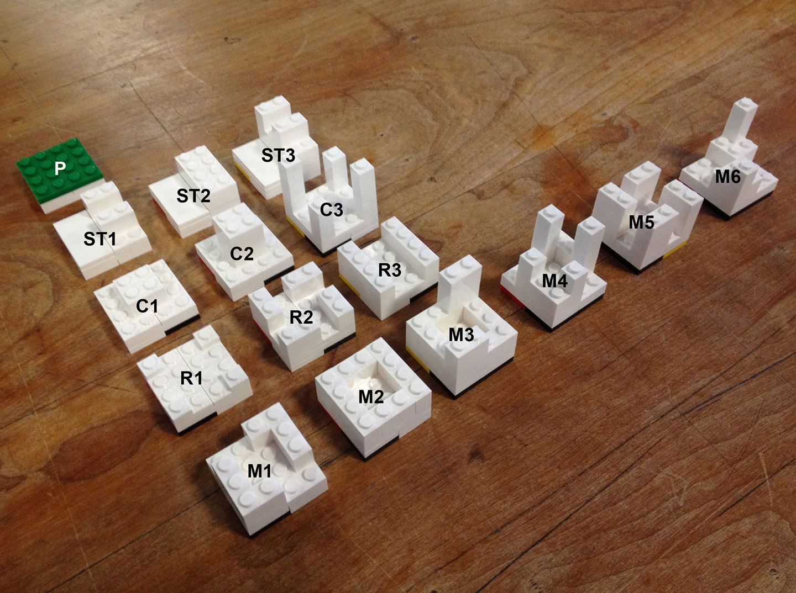
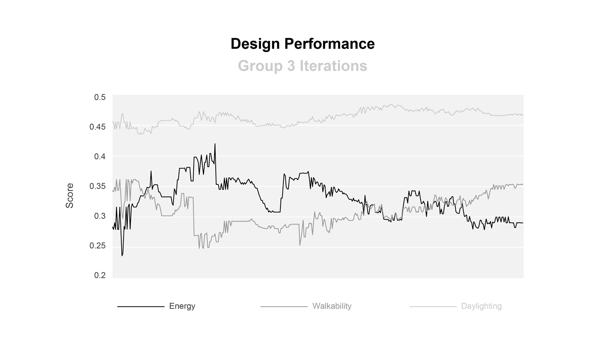

* TOC
{:toc}
{:toc_levels 1..2}
{:.sidebar}

# A tangible interface for collaborative urban design for energy efficiency, daylighting and walkability
---

[Full paper](http://www.ibpsa.org/proceedings/BS2015/p2296.pdf)

**Rose, C., Saratsis, E., Aldawood, S., Dogan, T., & Reinhart, C.F. (2015)**

*Building Simulation 2015: International Conference  
of the Building Performance Simulation Association  
Hyderabad, India, December 2015  
pp. 2691-2698*

## Abstract

An increasingly urbanizing human population presents new challenges for urban planners and designers. While the applicability of urban design tools for simulation experts is constantly improving, urban development scenarios require the input of multiple stakeholders, each with different outlooks, expertise, requirements, and preconceptions, and good urban design requires communication and compromise as much as it requires effective use of tools. The best tools will facilitate this communication while remaining evidence-based, allowing diverse planning teams to develop high quality, healthy, sustainable urban proposals.

Presented in this paper is a new such tool, implemented as a tangible user interface, that allows varied stakeholders to quickly collaborate on creation and exploration of new urban design solutions. The tool provides performance feedback for a neighborhood’s operational energy costs, daylight availability, and walkability. Fast interaction is attained through a novel precalculation method that is also presented and validated. Details of the tool’s deployment as part of a case study that was conducted with members of the planning commission of Riyadh, SA, in March 2015 are given.

## Introduction

Cities across the planet are growing at an unprecedented speed: The United Nations predicts two million additional city dwellers per week until 2030 [[United Nations, 2014]](#references). To accommodate this massive growth, cities must both expand and densify, but the quality and efficiency of new and existing neighborhoods must not therefore suffer. They should instead be designed for resource-efficiency, with quality indoor and outdoor spaces that support communities and favor human-powered modes of transportation such as walking and biking. In recent years, the building performance simulation community has made significant progress towards developing planning tools that predict various measures of urban sustainability, from operational [[Nouvel et al., 2013; Reinhart et al., 2013; Robinson et al., 2009]](#references) and embodied building energy use [[Davila and Reinhart, 2013]](#references) to daylight [[Dogan et al., 2012]](#references) and walkability [[Rakha and Reinhart, 2012]](#references).

Some of these tools are usable by urban designers and architects, but the neighborhood design process generally involves many more stakeholders, including city governments, citizens, developers, financiers, and others, and is far more complicated than simple selection of the *best* solution as identified by a computer program. Diverse interest groups prioritize different urban attributes, so maximal satisfaction requires compromise.

Unfortunately, with stakeholders’ varied interests come varied preconceptions and assumptions. In order to make multi-stakeholder urban planning discussions more evidence-based and productive, design proposals must be evaluated based on meaningful urban performance metrics so that tradeoffs can be better understood. Indeed, using urban planning tools, a design team can nowadays prepare design variants before a stakeholder meeting to guide a discussion, but consideration of new ideas during the meeting itself is impractical due to model input and execution time. Consequently, the shared creative wisdom of all involved stakeholders is underutilized, and a lack of participant *ownership* over prepared solutions hinders buy-in. In the worst cases, this disengagement causes discussants to revert to conversations grounded in their individual preconceptions, dismissing (implicitly or otherwise) the evidence-based proposals presented entirely.

What is needed is a collaborative design tool that:

* allows non-expert stakeholders to actively contribute their ideas during a planning session
* provides real-time analysis feedback on emerging design ideas in order to quickly advance the design process, and help participants identify acceptable solutions

One possible approach is the use of a tangible user interface (TUI) [[Ullmer and Ishii, 2000]](#references), which is a system marrying representation and control, allowing novice users to perform urban design and see the results of their design in real time without any modeling training. Such physical design interfaces have previously found success in architectural and urban design and analysis [[Huang et al., 2003; Piper et al., 2002; Seichter and Schnabel, 2005; Strzalka et al., 2011; Underkoffler and Ishii, 1999]](#references).

This document presents a new such collaborative design tool that uses Lego blocks to allow novices to design a neighborhood. A camera and projection system colorize the blocks to present the neighborhood’s performance to the users in real-time. The simulated performance metrics are operational building energy cost, annual daylight availability in buildings, and neighborhood walkability. Real-time interactivity is achieved with a novel simulation approximation method that was validated against more detailed, traditional simulation approaches. The overall system was deployed as a *game* in a case study at the planning commission of Riyadh, Saudi Arabia, and the results of that case study are given and discussed.

## Neighborhood performance

### Energy

Buildings significantly contribute to cities’ energy needs, and despite recent attention to embodied energy costs, operational energy analysis generally dominates discussions. However, neighborhoods comprise multiple buildings, and devising a metric useful for inter-building comparison is a challenge. One commonly used energy metric is energy use intensity (EUI), which is defined as the ratio of a building’s annual energy use to its net conditioned floor area. But, while this metric is useful for comparing a building’s energy performance to that of another building of the same type, its failure to account for building population diminishes its effectiveness for urban analysis. For example, a larger single family building of high construction standard may have a very low EUI compared to an apartment building because internal equipment loads are spread across a larger area, but the efficiency per occupant is lower simply because this building type tends to accommodate fewer residents. Normalization by population, not area, is therefore a better choice for a metric to promote urban density and efficiency. Furthermore, the traditional expression in annual kWh is difficult for a layperson to grasp; conversion to financial cost is far more intuitive for the game’s intended users. This has the additional benefit of accounting for use-sensitive electricity costs. The final energy metric used for the game was therefore operational energy cost in dollars per person and year. The mertric can be displayed on a building-by-building level as well as an average for a whole neighborhood.

### Daylighting

Daylight access is widely recognized as an indicator of the quality of a building and the health and wellbeing of its occupants. The US Green Building Council’s LEED green building rating system as well as the Illuminating Engineering Society of North America (IESNA) focus mostly on a spatial metric called daylight autonomy that describes the percentage of the occupied time in a year when interior lighting levels due to daylight are above 300 lux. A space is *daylit* if its daylight autonomy is above 50%, i.e. there is sufficient daylight at least half of the year. In accordance with these standards, the daylighting metric used for the game was spatial daylight autonomy [[IESNA, 2012]](#references), which is the percentage of a building’s floor area that is daylit. Again, the metric was provided per building and for the overall neighborhood.

### Walkability

One benefit of urban density is that residents may walk or bike instead of relying on non-human powered modes of transportation. This benefit is twofold: residents tend to be healthier [[Pucher et al., 2010]](#references), and energy use related to transportation tends to be lower. A quantified walkability score from 0.0 to 1.0 was therefore selected as the third performance metric in the game.

## System Setup

The system’s physical interface consists of a plexiglass tabletop with a grid upon which users can place pre-assembled Lego blocks, each representing an 80-meter by 80-meter city area, to build a neighborhood. There are sixteen block types to choose from: One represents a park space, and each other represents one or more commercial, residential, or mixed-use buildings. Each of these buildings has all of its design characteristics predefined, including construction assemblies, occupancy, internal gains, and window-to-wall ratios. Each block type is represented by an alphanumeric code such as *C2* or *ST3* and has, on its base, a color code indicating its type, which is read by a camera mounted underneath the table. Figure 1 shows each of the sixteen block types. Whenever a change to the block configuration is made, the camera sends the new configuration to a computer, which calculates performance scores for all three neighborhood metrics and uses these scores to colorize the blocks on the table via a projector mounted above it. Figure 2 shows a diagram of the system’s component interactions, which are an impelementation of the MIT Media Lab’s CityScope technology [[Winder, 2015]](#references).

{: .figure}
*Figure 1: The sixteen available block types*{: .caption}
Performance scores are calculated for each block as a value between 0 and 1, which is then mapped to a color on a spectrum from red (for *bad* blocks) through yellow to green (for *good* blocks). At any point, only one of the three metrics is used to colorize the table blocks, and users can change this *active* metric at will, allowing them to focus on a particular neighborhood performance aspect. In addition to block-level scores, a neighborhood-level score is calculated for each metric and displayed on a large monitor behind the table along with a colorized, 3D rendering of the designed neighborhood.
Figure 3 shows a photograph of the operational interface.

{: .figure}
*Figure 2: The system’s component interactions*{: .caption}

## Score Calculation

### Energy

The need for building energy consumption calculations to be sufficiently fast for interactive use of the table proscribes not only the direct use of detailed simulation engines such as EnergyPlus [[DOE, 2013]](#references) but any programs or algorithms that invoke such an engine, even in a simplified way, such as Dogan and Reinhart’s Shoeboxer algorithm [[Dogan and Reinhart, 2013]](#references). The design system instead approximates energy consumption using presimulated energy performance data for buildings modeled on the site in question. This means that each instance of the design game is custom-tailored for a specific site; in our case study, this was a neighborhood in Riyadh, Saudi Arabia. Presimulation relies on the fact that each available building is fully specified in every way except geometric position, so users cannot modify any thermal performance factors of buildings they place.

The assumption driving the presimulation approach is that with all of a building’s properties except positioning held constant, its energy consumption according to EnergyPlus varies only with incident solar radiation, which varies with the proximity and type of neighboring structures. This assumption is reasonable in Saudi Arabia, as heating loads are essentially nonexistent, and blinds are generally kept closed, eliminating electric lighting being dimmed.
Building simulation parameters such as construction assemblies, glazing properties, internal loads, and occupancy schedules were selected based on surveys of Kuwaiti building stock [[Al-Mumin et al., 2003; Assam and Al-Ragom, 2009; Cerezo et al., 2015]](#references), the Kuwati energy code [[MEW, 2010]](#references), and the ASHRAE 90.1 standard for international climate zone 1. Each building on each block was presimulated using the Riyadh Typical Meteorological Year (TMY) under a variety of shading conditions. For each shading condition, the sky view factor [[Hopkinson et al., 1966]](#references) of the building centroid’s projection to the ground was calculated using the Radiance [[Ward, 2014]](#references) backward raytracer, and its energy consumption was simulated using the Shoeboxer. (The Shoeboxer was used instead of a detailed EnergyPlus simulation in order to expedite post-gameplay comparison of approximated results to simulated ones.) The shading conditions were generated by surrounding each building’s block by an open box of gradually increasing height, as demonstrated in Figure 4. Figure 5 shows an example presimulation curve for one of the game buildings.

*Figure 3: The operational system*

These pairs of sky view factors and simulation results were assembled into a lookup table. During gameplay, a building’s sky view factor was again calculated, and the two energy consumption values in the lookup table with the nearest corresponding sky view factors were averaged to yield the approximated energy consumption.

*Figure 4: Example artificial shading conditions for presimulation of block type C2*

*Figure 5: Presimulated energy performance of the commercial building on ST2 blocks*

The mapping from energy performance costs to scores between 0 and 1 was linear, and its bounds were determined by the absolute minimum and maximum costs generated during presimulation. Figure 6 shows where on the entire red-green color spectrum each simulated block could fall. Three particularly inefficient blocks (*C3*, *ST1* and *R1*) were always assigned a score of 0 in order to avoid distorting the overall mapping and allow for greater color variation among the other block types. However, each individual block type does not vary much; for the buildings investigated, insolation has a relatively limited effect on a building’s energy consumption in Riyadh.

### Daylighting

As with operational energy, neither a detailed simulation itself (e.g. using DAYSIM nor an algorithm invoking a detailed simulation in a simplified way (e.g. Urban Daylight [[Dogan et al., 2012]](#references) is fast enough for interactive use of the design environment. So again, presimulation is used. During the presimulation step, each building’s spatial daylight autonomy is additionally simulated using Urban Daylighting and used to create second lookup table, this time mapping sky view factor to sDA. The presimulation was executed for one week in spring, for performance purposes, under the assumption that seasonal daylighting variation in Riyadh is not extreme. Figure 7 shows an example daylighting presimulation curve. During gameplay, these curves are used analogously to those of operational energy consumption. However, sDA, being a percentage, is already a value between 0 and 1 and does not need to be mapped the way energy consumption does. Figure 8 shows the possible daylighting color scores for each block type; note that each type has a much wider possible range, indicating daylighting’s greater sensitivity to sky view factor.

### Walkability

Neighborhood walkability calculations are based on a modified version of the Walk Score algorithm, originally published in 2011 [[Walk Score, 2011]](#references), adapted to the Saudi context. This algorithm assigns walkability scores to residential locations based on the proximity and quantity of local amenities, which are predefined properties of blocks with commercial buildings on them. To score, trips from a building to the closest amenities are first generated and scored according to their distance, with a maximum score at zero meters decaying to a zero score at 250 meters according to a particular fifth-order polynomial function. The maximum trip length of 250 meters was chosen based on surveys distributed to Saudi residents asking them about their walking preferences. 70% of a building’s walkability score is the average of the scores of the shortest 24 trips to commercial amenities, and the remaining 30% is the score of the trip to the closest park.

The original 2011 Walk Score algorithm relied on an explicitly defined pedestrian travel network, and its navigation is the most time-consuming step of the calculation. As the presented interface has no means of defining such a street network, the assumption is made that all Manhattan (orthogonal) pedestrian travel is possible, but no diagonal travel is.

*Figure 7: Presimulated daylighting performance of the commercial building on ST2 blocks*

*Figure 8: Possible daylighting color ranges. Available scores are much more diverse than for energy*

## Case Study

The case study entailed nineteen employees of the Arriyadh Development Authority (ADA), the planning authority for the city of Riyadh, Saudi Arabia, playing the game in March 2015. The employees had various backgrounds, including architecture, urban planning, geographic information systems (GIS), and information technology support. None of them had any building or neighborhood simulation experience.

The employees were broken into four teams of four to six players each. Each team was given a few minutes of simple explanation of the system’s operation and then presented a scenario involving the complete redevelopment of the Dhahira neighborhood, a neighborhood in Riyadh that the ADA expects to experience significant redevleopment within the coming decades. Each team’s gameplay period was 30 minutes long. The players were instructed to first build up a neighborhood and then optimize it according to any or all of the three performance metrics. At the conclusion of gameplay, all four groups came together to present and evaluate their respective designs.

## Results

### Neighborhood design

Figures 9, 10, and 11 show the performance of the designs of groups 2, 3, and 4 over time. (Group 1’s results have been omitted due to a camera calibration problem that caused incorrect color projection, rendering the recorded data unusable.) In each graph, the horizontal axis is the design iteration, and the lines show the neighborhood-wide values of the three performance metrics. The background color of the graph indicates which metric was *active* at each design iteration. The results show that groups with the energy and walkability metrics active were able to increase their designs’ performance with respect to those metrics (rising orange and blue lines), but the daylighting view was unhelpful (flat grey lines). A priority pattern among the three performance metrics emerges as groups spent the most time optimizing for neighborhood walkability, followed by energy, with daylighting receiving little attention.

### Approximation accuracy

The accuracy of the presimulation method employed to approximate energy and daylighting performance was examined by comparing approximated values from the lookup tables to the results of the actual simulations that they were supposed to be approximating. Comparing every approximated value with a corresponding simulated value at every design iteration would have been intractable, so comparison points were selected by identifying design iterations that players paused on for at least five seconds (under the assumption that during these periods players were examining board coloration for guidance) and then selecting blocks that had changed from the previous iteration, along with their neighbors. Some block types were therefore excluded from analysis, but this was symptomatic of these block types’ underuse during gameplay, and so the accuracy of their approximations is irrelevant to the case study.

*Figure 9: Group 2’s neighborhood’s performance over time with respect to all three metrics*

*Figure 10: Group 3’s neighborhood’s performance over time with respect to all three metrics*

*Figure 11: Group 4’s neighborhood’s performance over time with respect to all three metrics*

Figure 12 compares approximated block energy scores to energy scores generated by post-facto simulation. Most approximations are quite good, and the more substantial errors are closely clustered by block type. One source of errors is R3 blocks, which is a block type containing two long, narrow buildings. Two instances of *R3* blocks demonstrated little error, and these instances were uses of the blocks in the same orientation as they were during presimulation, while the others were rotated 90 degrees. The other two error clusters were of *M2* and *M4* blocks, both mixed-used blocks containing relatively complex building geometry.

Figure 13 shows an analogous comparison of daylighting scores. The approximation method fared worse than it did for energy performance, although still acceptably, and blocks within a type still tended to demonstrate consistent errors.

No examination of walkability approximation accuracy was performed, because there was no formal way to undo the simplification (the inference of an accommodating pedestrian travel network) applied.

*Figure 12: Approximated versus simulated energy scores. Errors are largely consistent for a given block type*

*Figure 13: Approximated versus simulated daylighting scores. Each color represents a different block type*

## Discussion

The gameplay results demonstrate that the described table interface can be an effective assistant for collaborative, simulation-guided neighborhood design by simulation novices. However, several avenues for improvement suggest themselves.

The first relates to the table’s ineffectiveness at daylighting optimization assistance. This can likely be explained by the game’s relative lack of responsiveness in this domain. A block’s energy score, while relatively unaffected by blocks around it, was substantially affected by the choice of a the block itself, and so players could identify *good* blocks to design with. A block’s walkability score, in contrast, was obviously and substantially affected by blocks arround it, so players could improve walkability scores by adding parks and dense commercial areas. Daylighting, however, had neither of these benefits; most blocks spent most of their time as some shade of dark orange. As a result, players could not learn how to improve their designs on either a local or global level, which they remarked was frustrating. Future iterations of the game should avoid this by ensuring that each performance metric is sufficiently responsive to player input. This might be achieved by a more sophisticated presimulation obstruction model, careful block design and testing, provision of parametric control to users during gameplay, or some other method.

Players spent little time even trying to optimize for daylighting. This may be due to a cultural disregard for that building performance feature that stems from the way buildings are operated in Saudi Arabia (this was mentioned explicitly more than once by players). Future games should therefore carefully select culturally relevant metrics; in this case, water consumption or parking would have been better choices.

It has been shown that the novel lookup table-based simulation approximation method works very well for the investigated climate and buildings, especially for the collaborative, early planning tasks intended, and it was fast enough for interactive use. However, its errors still deserve investigation. The fact that each block type demonstrated consistent errors for both energy and daylighting suggests that the errors stem from particular inadequacies in the relationships between the underlying simulation engines and the defined block geometries rather than a fundamental methodological problem. These relationships must therefore be comprehensively explored beforehand to ensure that the approximation works. That daylighting approximations were more error prone than energy approximation is unsurprising, as energy simulations in a cooling-dominated climate mainly depend on total annual solar radiation levels incident on a building whereas for daylight the temporal availability of light is more important. One improvement might have been to calculate the sky view factor at multiple points for each building, rather than just one.

The approximation method itself relies on the very strong assumption that energy consumption varies mainly with insolation. This needs to be tested in climates other than Riyadh where electric lighting dimming, and more importantly, heating, are relevant. A mixed climate (e.g. Boston) or a cold climate (e.g. Anchorage) would be good candidates.

Purely logistical improvements to gameplay are available. The simplest is the extension of design periods: Every group worked right up to the 30 minute limit, and seemed fully ready to take advantage of additional time. Longer session lengths, such as 45 or 60 minutes, might be more useful. Additionally, the physical apparatus itself was quite susceptible to bumping, which caused incorrect reports to users until the the scanning camera was re-calibrated. Although this process is fast, the interruption to player focus is unsatisfactory, as is the possibility of users spending substantial time designing before the error is even corrected (as with the first group in the case study).

Finally, the block library should be well-curated. Of the sixteen available block types, four found little to no use during gameplay. This can be partially explained by these blocks performing strictly worse than other, similar blocks, but not entirely, as other blocks with this characteristic, specifically low density residential blocks, found heavy use. What is more likely is that players found no obvious urban role for the neglected blocks. The block library should be designed from the perspective of specific roles from the outset in order to minimize neglected block types. An incidental benefit of is this approach is that these roles can be directly presented to users to more clearly explain how the game works.

This problem calls attention to another that fortunately did not materialize. The use of low-density residential blocks, in spite of their poor performance, indicated that players were using the tool to truly design a neighborhood, rather than simply solve an optimization problem. They adapted the game to their needs, using its quantitative feedback to guide their qualitiative analysis but not replace it.

## Conclusion

Presented here was a new tangible user interface *game* for fast, interactive, collaborative, simulation-guided urban design suitable for use by a variety of potential stakeholders of an urban development project. The system currently provides design feedback in terms of operational energy costs, daylight availability, and neighborhood walkability, but could be easily extended to support other performance metrics. Interactive speeds for operational energy and daylighting calculations are obtained via a novel approximation approach based on presimulating buildings before gameplay, and while this approach appears suitable for the climate of Riyadh, Saudi Arabia, the location of the case study in which the game was initially deployed, it demands further validation and exploration in other climates.

## Acknowledgements

This work was made possible by the Center for Complex Engineering Systems at the King Abdulaziz City for Science and Technology in Saudi Arabia, the Massachusetts Institute of Technology, the Masdar Institute of Science and Technology, and the Alexander S. Onassis Public Benefit Foundation. The authors would like to thank Faisal Aleissa, Tariq Alhindi, Almaha Almalki, Riyadh Alnasser, Tarfah Alrashad, Areej Al-Wabil, Carlos Cerezo Davila, Ali Irani, and Ira Winder for their invaluable contributions to the design and development of the game.

## References

* Al-Mumin, A., Khattab, O., & Sridhar, G. (2003). Occupants’ behavior and activity patterns influencing the energy consumption in the Kuwaiti residences. Energy Build. 35, 549–559.

* Assam, E.O., & Al-Ragom, F. (2009). The effect of reinforced concrete frames on the thermal performance of residential villas in hot climates. International Journal of Energy Technology and Policy 7, 46–62.

* Cerezo, C., Sokol, J., Reinhart, C., & Al Mumin, A. (2015). Comparison of three methods for the characterization of building archetypes in urban energy simulation. Proceedings of Building Simulation 2015: 15th Conference of the International Building Performance Association.

* Davila, C.C., & Reinhart, C. (2013). Urban energy lifecycle: An analytical framework to evaluate the embodied energy use of urban developments. Proceedings of Building Simulation 2013: 13th Conference of the International Building Performance Association.

* DOE (2012). EnergyPlus Energy Simulation Software, V.7, [https://energyplus.net](https://energyplus.net)

* Dogan, T., & Reinhart, C.F. (2013). Automated conversion of architectural massing models into thermal 'shoebox' models. Proceedings of Building Simulation 2013: 13th Conference of the International Building Performance Association.

* Dogan, T., Reinhart, C.F., & Michalatos, P. (2012). Urban daylight simulation calculating the daylit area of urban designs. Proceedings of SimBuild.

* Hopkinson, R.G., Petherbridge, P., & Longmore, J. (1966). Daylighting. Heinemann.

* Huang, C.-J., Yi-Luen Do, E., & Gross, D. (2003). MouseHaus Table: a Physical Interface for Urban Design. Proceedings of the 16th Annual ACM Symposium on User Interface Software and Technology.

* IESNA (2012). LM-83-12 IES Spatial Daylight Autonomy (sDA) and Annual Sunlight Exposure (ASE). IESNA Lighting Measurement, New York, NY, USA.

* MEW (2010). Energy conservation program. Code of Practice MEW/R-6/2010. Ministry of Energy and Water. Kuwait City, Kuwait.

* Nouvel, R., Schulte, C., Eicker, U., Pietruschka, D., & Coors, V. (2013). CityGML-based 3D city model for energy diagnostics and urban energy policy support. Proceedings of Building Simulation 2013: 13th Conference of the International Building Performance Association.

* Piper, B., Ratti, C., & Ishii, H. (2002). Illuminating clay: a 3-D tangible interface for landscape analysis. Proceedings of the SIGCHI Conference on Human Factors in Computing Systems.

* Pucher, J., Buehler, R., Bassett, D.R., & Dannenberg, A.L. (2010). Walking and cycling to health: a comparative analysis of city, state, and international data. Am. J. Public Health 100, 1986–1992.

* Rakha, T., & Reinhart, C. (2012). Generative urban modeling: A design work flow for walkability-optimized cities. Proceedings of SimBuild 2012.

* Reinhart, C.F., Dogan, T., Jakubiec, J.A., Rakha, T., & Sang, A. (2013). Umi-an urban simulation environment for building energy use, daylighting and walkability. Proceedings of Building Simulation 2013: 13th Conference of International Building Performance Simulation Association.

* Robinson, D., Haldi, F., Kämpf, J., Leroux, P., Perez, D., Rasheed, A., & Wilke, U. (2009). CitySim: Comprehensive micro-simulation of resource flows for sustainable urban planning. Proceedings of Building Simulation 2011: 11th Conference of International Building Performance Simulation Association.

* Seichter, H., & Schnabel, M.A. (2005). Digital and Tangible Sensation: An Augmented Reality Urban Design Studio, in: 10th International Conference on Computer Aided Architectural Design Research in Asia, CAADRIA, New Delhi, India. pp. 193–202.

* Strzalka, A., Bogdahn, J., Coors, V., & Eicker, U. (2011). 3D city modeling for urban scale heating energy demand forecasting. HVACR Res. 17, 526–539.
Ullmer, B., Ishii, H., 2000. Emerging frameworks for tangible user interfaces. IBM Syst. J. 39, 915–931.

* Underkoffler, J., & Ishii, H. (1999). Urp: a luminous-tangible workbench for urban planning and design, in: Proceedings of the SIGCHI Conference on Human Factors in Computing Systems. ACM, New York, NY, USA, pp. 386–393. doi 10.1145/302979.303114

* United Nations (2014). World Urbanization Prospects: The 2014 Revision, Highlights. U.N. Department of Economic and Social Affairs, Population Division, New York, USA.

* WalkScore (2014). WalkScore. Retrieved November 2014. [http://www.walkscore.com](http://www.walkscore.com)

* Ward, G. (2014). Radiance. Retrieved November 2014. [http://radsite.lbl.gov/](http://radsite.lbl.gov/)

* Winder, J.I. (2015). System for Real-time Digital Reconstruction and 3D Projection-Mapping of Arbitrarily Many Tagged Physical Objects (Technology Description). Massachusetts Institute of Technology.