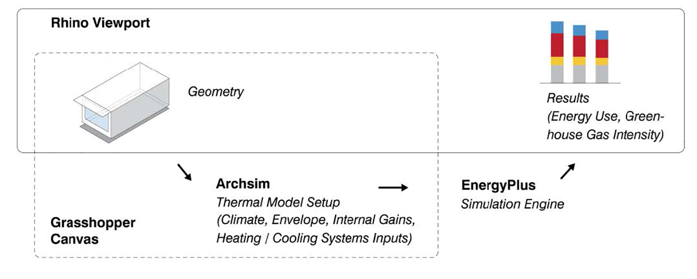
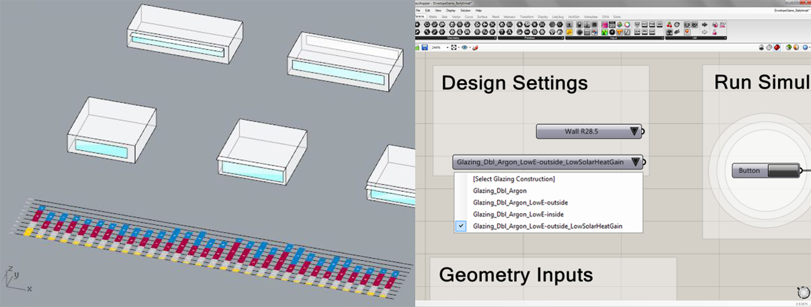

* TOC
{:toc}
{:.sidebar}

# Lessons learnt from a simulation-based approach to teaching building science to designers
---

[Download full manuscript](http://www.ibpsa.org/proceedings/BS2015/p2468.pdf)

**Reinhart, C.F., Geisinger, F., Dogan, T., & Saratsis, E. (2015)**

*Building Simulation 2015: International Conference  
of the Building Performance Simulation Association  
Hyderabad, India, December 2015  
pp. 1126-1133*

## Abstract

This manuscript describes lessons learnt over the course of several years of teaching building performance simulation to architectural students as part of an introductory building science class. Over the course of a term, students are exposed to a design analysis workflow that links architectural massing models in Rhinoceros 3D to Radiance/Daysim and EnergyPlus. Starting with shading and window-to-wall ratio studies, the students tackle increasingly complex tasks which culminate in a 90-min simulation game. For the game students compete in pairs to design a 3000m2 office building with the lowest greenhouse gas emissions per floor area in Phoenix, AZ. Playing the game with a class of 18 undergraduate and graduate students during the fall of 2014, eight teams managed to prepare and run between 9 and 53 design variants with final emissions varying between 37 and 64kgCO2/m2. The act of learning while playing proved to be an effective way to intellectually engage the students and help them to discover best sustainable design practices for the investigated building type and climate by themselves.

> The act of learning while playing proved to be an effective way to intellectually engage the students and help them to discover best sustainable design practices for the investigated building type and climate by themselves.

## Introduction

Design practice and education have long gone digital. A mere decade ago this statement would have implied that design outputs such as construction documents, plans, sections and perspective drawings are being generated from a CAD or BIM model. However, with the rise of parametric tools and digital fabrication techniques, the very process of how and what gets designed has changed. The capability to rapidly generate thousands of design variants has led to new questions of how to evaluate then in tandem with aesthetical concerns. To address this question, design tools have been linked to building performance simulation (BPS) programs enabling users to quantify the thermal, lighting and structural performance of a design proposal with minimal effort [[Lagios et al., 2010; NREL, 2015; Karamba, 2015]](#references). A building energy analysis that used to take a specialist consultant days to prepare can now be generated from schematic design-phase models within minutes. In 2012, the American Institute of Architects (AIA) released an *'Architect’s guide to integrating energy modelling in the design process'* that explicitly encourages AIA members to adopt such simulation workflows to enhance the performance of their designs [[AIA, 2012]](#references). What are the consequences and potential pitfalls of this trend?

Several years ago, the authors argued that “being able to read thermal simulation results and to adapt one’s design accordingly has become an essential skill for graduating and practicing architects” [[Reinhart, Dogan, Ibarra and Samuelson, 2012]](#references). In order to enforce this skill set, the authors originally developed and tested a 90-min in class exercise during which participants were asked to identify the building with the lowest Energy Use Intensity (EUI) out of a large parametric set of design options. At the time, the game setup required a group of players (architecture students) and a support group of “simulation experts” with training in BPS to simulate the design proposals brought forward by the players. The task of the players was to understand and react to a proposal’s simulated monthly heat balances and fuel uses and to iteratively come up with new design proposals until the game time was up. Since the game itself took only 90 minutes, the exercise could be conveniently inserted into a conventional NAAB-required environmental technologies class as is being taught across North America in accredited architecture programs [[NAAB, 2015]](#references).

The reception of the original game as a mode of engaged learning was very positive among the students. The main complaints with the game were that no gaming strategy was provided how to systematically react to simulation results and that the range of efficiency measures provided was too extensive for the limited amount of time given, leading to a fair amount of guesswork. The authors further noted that the game, apart from its direct learning outcomes, also fulfils the role of a *'teaser'*, prompting interested students to take more advanced BPS classes, as they are increasingly being offered at schools of architecture and/or collaborating engineering departments. Depending on the popularity of these advanced classes, such activities may create a local energy modelling culture that promotes the use of BPS tools in design.

Since the writing of that manuscript, a rising number of schools of architecture have invested into analysis tools that directly link BPS to design environments, increasing the number of architects who are being trained in this domain. Nevertheless, given the widely perceived notion that climate change mitigation deserves society’s full attention along with the pivotal role that buildings play within this process, one may question whether the current rate of adoption of PBS in architectural practice and education suffices. Can society afford that only a fraction of architects and urban planners practice the use of evidence-based, sustainable design methods in favour of less specific rules of thumb? To fully address this question, it has to be shown that:

* architecture students can learn how to use PBS tools effectively within the time constraints of an introductory building technology class
* the students’ resulting designs are superior to those that would have been created in the absence of these tools

In order to demonstrate these two points, the manuscript describes the evolution of the original simulation game into a broader pedagogical approach in which building physics concepts are taught through a series of simulation exercises that are based on design analysis workflows that link Rhinoceros3D (Rhino) massing models to Radiance, Daysim and EnergyPlus. The exercises are described below, followed by the outcomes and lessons learnt from applying them at the authors’ home institution.

## Methodology

### Simulation environment

All simulation exercises are based on the Rhinoceros 3d (Rhino) [[McNeel, 2012]](#references) plug-ins DIVA [[Jakubiec & Reinhart, 2011]](#references) and ArchSim [[Dogan, 2013]](#references). DIVA is a simulation environment that supports a variety of design analysis outputs from physically-based visualizations using Radiance [[Ward & Shakespeare, 1998]](#references) to annual daylight availability metrics using Daysim [[Reinhart & Walkenhorst, 2001]](#references). ArchSim complements DIVA by offering multi-zone thermal modelling capabilities in EnergyPlus [[Crawley, 2000]](#references) that are particularly geared toward load calculations for whole building massing models. While DIVA has components both in the Rhino viewport as well as in Rhino’s parametric scripting environment, Grasshopper [[McNeel, 2012]](#references), ArchSim is purely Grasshopper based. As shown in Figure 1, this means that ArchSim models link a geometry in the Rhino viewport to a series of ArchSim components on the Grasshopper canvas. The component allow users to manipulate a variety of simulation inputs which are then sent to EnergyPlus. Simulation outputs are automatically displayed on the Rhino canvas. Since the writing of this manuscript an *Autozoner* algorithm has been added to ArchSim that automatically generates ASHRAE 90.1 Appendix G compliant multi-zone thermal models out of arbitrarily shaped massing models [[Dogan, Reinhart & Michalatos, 2015]](#references). This feature was not fully functional during the time when the class was taught which is why all massing models were converted into single zone thermal models during the simulation game exercises 6 and 7 described below. The impact of this simplification on simulation accuracy will be evaluated below.

### Simulation exercises

A series of interlinked simulation exercises were developed, tested and refined over several years by the authors while teaching an NAAB required introductory, 14-week course to undergraduate and graduate students at MIT. The exercises presented in the following correspond to the Fall 2014 version of MIT 4.401 Architectural Building Systems. The class enrolment consisted of 12 undergraduate and 6 graduate architecture students. The undergraduate students were all in their first semester of architecture studies and also enrolled in a class that taught them advanced modelling concepts in Rhino. The graduate students were already familiar with Rhino at the beginning of the class. The very basic Grasshopper skills required for the ArchSim exercises were covered during weekly lab sessions. Table 1 shows an overview of the class and exercises. The complete syllabus is available from the authors’ web site.

| Lecture 1 | Lecture 2 | Lab/Exercise |
| :-- | :-- | :-- |
| | Energy Use in Society | Essay |
| Energy Use in Buildings | Understanding Climate I | Shading Study (DIVA) |
| Understanding Climate II | Thermal Comfort | Psychrometric Chart |
| Thermal Mass & Heat Flow | Insulation Materials | Insulation Study ArchSim |
| Active & Passive Solar | Radiation Maps | PV Design (DIVA/ArchSim) |
| Window Technologies | Internal Gains & Infiltration | Envelope Game (ArchSim) |
| Load Calc (manual) | Load Calc (digital) | |
| Static Shading Design | Simulation Game | Simulation Game (ArchSim) |
| HVAC I | HVAC II | |
| Daylight & Photometry | Daylighting Rules of Thumb| Daylit Area, HDR Photography |
| Daylight Simulations | El. Lighting & Controls | Daylit Area Calc (Daysim) |
| Natural Ventilation I | Natural Ventilation II | |
| Case Studies I | Case Studies II | |
| | Final Presentations | |

*Table 1: Weekly course syllabus*{: .caption}

A brief description of each exercise is presented below with an emphasis on the ones with a simulation component.

* **Exercise 1** was an exploratory, 500 word essay asking students to imagine their lives a decade from today *'if everything goes well'* and how their lifestyle choices will relate to concepts of sustainable living.

* **Exercise 2** was a DIVA-based *Shading Study* in which students had to model an existing three-dimensional object in Rhino and compare photographs of the object taken at two times in the day under clear sky conditions to DIVA/Radiance visualization of the same conditions.

{: .figure}
*Figure 1: Rhino viewport on the left with GH canvas and ArchSim on the right*{: .caption}

* **Exercise 3** required students to carry a data logger measuring temperature and relative humidity along with them for a week and to practice mapping *'their life'* on a psychrometric chart.

* **Exercise 4** consisted of modelling a 10m x10m x 3m, conditioned but unoccupied space with different insulation thicknesses and window configurations in Rhino and exporting it to EnergyPlus via ArchSim. Goal of the assignment was to introduce the students to the simulation workflow while also teaching them the impact of construction assemblies and window layout on the energy required to condition a space.

* **Exercise 5** was a *PV Design* exercise for a 2.5kW PV system on a building located within a given urban context in Boston. System performance indicators were annual radiation maps and self-shading studies in DIVA/Radiance as well as monthly electricity yields in ArchSim/EnergyPlus.

For the remaining game-based exercises 6 and 7 a simplified ArchSim GUI was developed along with a results visualizer and archiver. The simplified GUI is mainly geared towards educational purposes and allows users to modify a controlled number of construction properties. Following each simulation, the visualizer automatically adds a new result to a bar graph along with a history of previous simulation results. Same as for the full ArchSim version, geometric parameters can be changed in the Rhino canvas whereas construction parameters are modified via pulldown menus in Grasshopper/ArchSim. Figure 2 shows a snapshot of the user interface.

* **Exercise 6** was an *Envelope Game* for which students had to design a very small (100m2) single story office building. The goal was to design the building with the lowest EUI by modifying building orientation, floor plan, insulation levels, glazing type and static shading design. All other design choices in Table 2 remained fixed to their defaults for this exercise. The game started during weekly lab time and lasted for an hour during which students were working in pairs. They were allowed to take the simulation exercise home and submit their results a day later. This was a key exercise to have students understand the relationship between solar gains, different glazing technologies, shading and resulting heating and cooling energy loads.

{: .figure}
*Figure 2: Envelope Game (exercise 6) - The automated results display shows annual fuel uses for heating, cooling, lighting and equipment for each variant tested (left); the ArchSim file allows to change design setting for wall insulation and glazing type (right)*{: .caption}

* **Exercise 7** was the main 90-min in-class midterm exercise. Students formed pairs and were asked to design a 3000m2 office building in Phoenix with the lowest greenhouse gas (GHG) emissions per floor area. The original game had used EUI as the deciding metric, mainly because these values are widely published. To sidestep the problem that EUIs for buildings with different fuel types (such as gas and electricity) somewhat mix *'apples and oranges'*, the decision in the original game had been to go with electric-only heating and cooling systems. For the new version, the authors decided to allow students to select between HAVC systems with different fuel types which triggered the choice to use GHG emissions as the driving metric. Same as for the original game, most baseline cases in Table 2 were chosen according to the ASHRAE 90.1-2007 Appendix G modelling protocol [[ASHRAE, 2007]](#references). To avoid complications associated with modelling heat flows between the building and the ground, exterior floor surfaces were modelled as adiabatic.

| **Roof Insulation** | | |
| :-- | :-- | :-- |
| R-value R20 (base) | U-value 0.284W/m2K | $.001/m2 |
| R-value R30 | U-value 0.187W/m2K | $.005/m2 |
| R-value R40 | U-value 0.131W/m2K | $.01/m2 |
| R-value R60 | U-value 0.091W/m2K | $.02/m2 |

| **Exterior Wall Insulation** | | |
| :-- | :-- | :-- |
| R-value R13 (base) | U-value 0.434W/m2K | $.001/m2 |
| R-value R19.5 | U-value 0.346W/m2K | $.003/m2 |
| R-value R28.5 | U-value 0.193W/m2K | $.008/m2 |

| **Wall-Window Ratio (WWR)** | | |
| :-- | :-- | :-- |
| Punched Openings | WWR 0.2 | linked to glazing type |
| Punched Openings | WWR 0.4 | linked to glazing type |
| Punched Openings | WWR 0.6 | linked to glazing type |
| Curtain Wall | WWR80 | linked to glazing type |

| **Glazing Type** | | |
| :-- | :-- | :-- |
| Dbl., no coat., Argon (base) | U-value 2.53W/m2K | $.009/m2 |
| Dbl., Low-e coat. #2, Argon | U-value 1.30W/m2K | $.024/m2 |
| Dbl., Low-e coat. #2, Argon, Solar Control | U-value 1.35W/m2K | $.036/m2 |

| **Exterior Shading** | | |
| :-- | :-- | :-- |
| None (base) | N/A | N/A |
| Shallow Overhang | Depth 0.5m | $4 |
| Medium Overhang | Depth 1.0m | $8 |
| Deep Overhang | Depth 1.5m | $12 |

| **Lighting Power Density** | | |
| :-- | :-- | :-- |
| Base | 11W/m2 (business hours) | $0 |
| Low | 9W/m2 (business hours) | $3.5 |

| **Daylight Sensors** | | |
| :-- | :-- | :-- |
| None | N/A | N/A |
| Installed | Perimeter zone 45m Target level 300lux | $5 |

| **Occupancy Sensors** | | |
| :-- | :-- | :-- |
| None | N/A | N/A |
| Installed | N/A | $5 |

| **HVAC System** | | |
| :-- | :-- | :-- |
| Gas Boiler, Dir. Exp. A/C | Heating efficiency 80% Cooling COP 3.1 | $0 |
| Elec. Radiant Heating, Dir. Exp. A/C | Heating efficiency 80% Cooling COP 3.1 | $5 |
| Ground Source Heat Pump | Heating COP 3.1 Cooling COP 3.93 | $10 |

*Table 2: List of design choices*{: .caption}

In order to better introduce cost considerations into the game, different upgrades in Table 2 were assigned different *MIT$* cost premiums. The magnitudes of the individual costs were meant to facilitate a comparative analysis between different technologies. Their absolute value was normalized so that for a *typical* design proposal with all upgrades activated the cost premium would be around *MIT$100*. The admissible costs for a valid design submission for the game was *MIT$50* or less. This cost cap was imposed to encourage players to explore trade-offs and paybacks of different choices. To ensure students’ undivided attention throughout the game, the winning team was awarded 10 extra percentage credits towards their final course grade.

* **Exercises 8 and 9** were concerned with daylighting analysis and simulations, asking students to first explore a daylit classroom at MIT via subjective evaluations and through various photometric measurements followed by a simulation exercise 9 to a build a calibrated daylighting model of the space and compare it to a calibrated high dynamic range photograph [[Reinhart, 2015]](#references).

As a final class project, the same teams worked again on an energy and daylighting concept for the Phoenix project but this time they had to balance resource efficiency with access to daylight and design aesthetics applying all analysis skills learnt throughout the class.

### Student presentations

Following the game, each student team was asked to present the logic that lead them from variant to variant as well as to comment on whether they felt that simulations helped them to improve the energy concepts of their designs or whether rules of thumb would have sufficed. They further had to comment on whether they trusted their results and if they would feel comfortable using their simulation skills in a studio environment or future practice.

## Results

While most of the result analysis focuses on the game exercises, it should be highlighted that exercises 2 and 5 ideally set the stage for familiarizing students with performance simulations due to the direct visual feedback that they offer between simulations andreality. Figure 3 shows an example submission for exercise 2, which demonstrated to the simulation newcomers that – if used correctly – BPS tools truthfully mimic reality. At the same time, this exercise provided an opportunity to review questions such as daylight savings time and model orientation which, if not correctly accounted for, lead to wrong simulation results.

{: .figure}
*Figure 3: Shading Study (exercise 2) on September 8 at 3:45pm - Photo (left) and DIVA/Radiance (right)*{: .caption}

Exercise 4 initiated a transition from what can be visually experience to the invisible world of building energy use. The exercise helped students to digest energy usage data since the only two variables considered were wall insulation and window placements. The students generally discovered that adequately sized windows may provide some energy savings and that additional energy savings quickly fall once insulation thicknesses are increased beyond a certain threshold level. It is worthwhile noting that –apart from running these simple simulations- the main emphasis of simulation-based assignments should be for students to analyse and comment on their results.

{: .figure}
*Figure 4: PV Design (exercise 5) - Radiation map (left), shading study on Dec 21 at noon (middle) and monthly electricity gains (right)*{: .caption}

Designing a PV system is an exercise that is part visual and part number crunching. Figure 4 shows the three required outputs for a PV system design namely an annual radiation map to demonstrate annual radiation shining on individual panels, a shading study on Dec 21 at noon to ensure that the panels remain unshaded throughout the year as well as an EnergyPlus prediction of monthly electricity gains from the system. Exercise 6 was a continuation of the exercise 4 but with a more complex parametric design space that allowed for many geometric variations especially regarding facade layout and static shading. Figure 5 shows how students used the results visualizer to systematically explore a large parametric space and learn while designing. Many students ended up formulating their own lessons learnt from the exercise such as *'south facing windows are great'*.

{: .figure}
*Figure 5: Student submission for Exercise 6 by Baily Zuniga and Irmak Turan*{: .caption}

At the point when the students played exercise 7, the 90-min simulation game, most of them seemed ready to intellectually take on a larger simulation project without feeling overwhelmed. Indeed, for 8 out of 9 groups the simulations went smoothly throughout the process. The 9th group had failed to install a working version of Rhinoceros on their laptops and had been struggling with hardware problems throughout the term. The remaining groups explored between 9 and 53 design variants each. The final submissions are documented in Figure 6 and Table 3 and exhibit a considerable variety of form and technology solutions. Given that Arizona is a cooling-dominated climate, the entries with the lowest GHG emissions tend to exhibit a combination of narrow floor plans, low WWRs in the 0.2 to 0.4 range, low-e coated double glazings with low solar heat gain coefficients, lighting loads reduced through efficient systems combined with occupancy and dimming controls as well as a ground source heat pump. Overall this combination closely matches what one might consider best sustainable design practice for that climate zone.

{: .figure}
*Figure 6: Final design submissions for Simulation Game (exercise 7)*{: .caption}

| Upgrades | GHG | Cost |
| :-- | :-- | :-- |
| **Team A** | | |
| Roof R20 Wall R13 WWR 0.2 Low-e Argon Occupancy Dimming Low LPD GSHP | 37kgCO2/m2 | $46 |
| **Team B** | | |
| Roof R20 Wall R28.5 WWR 0.2 Low-e Argon Occupancy Dimming Low LPD GSHP | 39kgCO2/m2 | $60 |
| **Team C** | | |
| Roof R30 Wall R13 WWR 0.4 Low-e Argon Occupancy Dimming Low LPD GSHP | 40kgCO2/m2 | $45 |
| **Team D** | | |
| Roof R30 Wall R28.5 WWR 0.4 Argon Shading 2m Occupancy Dimming Low LPD GSHP | 41kgCO2/m2 | $48 |
| **Team E** | | |
| Roof R20 Wall R13 WWR 0.2 Low-e Argon Shading 1.5m Dimming Low LPD GSHP | 39kgCO2/m2 | $44 |
| **Team F** | | |
| Roof R30 Wall R13 WWR 0.4 Low-e Argon Shading 0.5m | 59kgCO2/m2 | $35 |
| **Team G** | | |
| Roof R30 Wall R28.5 WWR 0.2 Low-e Argon Shading 1.5m | 64kgCO2/m2 | $43 |
| **Team H** | | |
| Roof R30 Wall R28.5 WWR 0.2 Low-e Argon Shading 1.5m | 59kgCO2/m2 | $9 |

*Table 3: Upgrades, GHG and cost for each of the final designs*{: .caption}

Figure 7 shows the development of GHG emissions over time for select design variants for each group. The students clearly managed to generate, run and analyse their simulation results and identify less carbon–intensive design proposals over the course of 90 minutes. The figure also shows a comparison of simulation results assuming a single zone for each building as opposed to the more proper way of modelling buildings as multi-zones. The difference between single and multi-zone models varies up to 23% with errors increasing for more complex building shapes, suggesting that using the Autozoner for massing studies is advisable and relevant. More importantly, in several instances using the single zone approach lead to wrong or misleading design feedback, for example for Team A (A08 to A12), Team E (E12 to E13), Team F (F13 to F31) and Team H (H01 and H06).

{: .figure}
*Figure 7: Develop GHG emissions for different designs for the eight student groups. Blue and while graphs compare simulation results assuming single or multi-zone thermal models. (student modelling error in Single Zone model d – dimming off)*{: .caption}

### Group strategies

While three groups followed an unstructured trial and error approach, five groups used one of the two following simulation strategies: In the first variant they started with a simple rectangular building and went through a series of building envelope studies (insulation, glazing type, window layout and shading) to identify a best envelope solution. They then developed a suitable massing based using that set of envelope settings. The alternative strategy was to explore different massings in default setting and then move on improving the envelope properties. Electric lighting controls and HVAC systems tended to be considered last which turned out to compromise the massing studies because the electric lighting in EnergyPlus is independent of building form unless photo-cell controlled dimming is invoked. The reason for the delayed use of electric lighting and HVAC might have been that both topics were only covered later in the class so students were not fully familiar with them during the game.

### Student feedback

Student feedback on the game was overwhelmingly positive. All students indicated that they felt that the use of simulations had helped to better explore how a sustainable design might actually work for a given building and climate than if they had just followed generic rules of thumb. The use of simulations *'allows for innovative designs and minimizes cookie cutter buildings'* as one group put it. Another repetitive argument in favor of simulations was that they provide near instantaneous results and help when designing in an unfamiliar climate.

Out of the eight groups that managed to get the simulations to work only a single student did not feel comfortable using the simulations taught in class going forward, expressing a scepticism regarding the ArchSim workflow and its reliability. The student’s main argument for this was that she felt that the inner working of the software had not been sufficiently covered in class. All other students stated that they did feel competent enough to use such simulations in the future.

Another sentiment shared by several students was that the Grasshopper file used for the simulation game was too complicated for them to adopt on their particular projects. This turned out to be true since most groups used the unmodified Grasshopper file for their final course projects. Same as for the original game, students felt that 90 minutes were too short to fully explore their design ideas.

## Discussion

The simulation game results described above show that architecture students can learn how to use and apply PBS tools within a semester-long class. Given the consistently high level of student engagement with the general course content, the authors felt that the general pedagogy of teaching building science through simulations was effective. Students reportedly left the class feeling empowered to use BPS in their future projects embracing an evidence-based mind set towards design. The fact that they repeatedly demanded to allow for more time during future versions of the games is particularly encouraging. Based on the positive experiences gathered in this and previous classes, the authors encourage other educators to consider a comparable teaching approach. The required game files are available from the authors’ web site.

As students conduct all simulations themselves, a single instructor plus a well-versed teaching assistant can satisfy all training needs for the class even though the number of required teaching staff will rise for a larger class. In such instances the use of online tutorials may serve as an important supplement to weekly lab sessions. This endorsement notwithstanding, the reader should realize that it is of paramount importance that instructors of such a class are intimately familiar with the strengths and limitations of the building simulation program used so that they can explain to students the difference between reliable design analysis results and erroneous artefacts caused by the limitations of the simulation program. For example, for the class taught by the authors, a number of *'surprises'* were related to the single zone modelling approach which led to photo sensor controls for a donut-shaped building to lie outside of the building. Such obvious shortcomings should disappear with the adoption of the Autozoner algorithm in future game versions.

One of the key elements that are still missing for the game is the explicit development of a simulation strategy to identify best sustainable design practices for a given program plus climate. The first author had sporadically mentioned useful strategies through the biweekly lectures but a more deliberate description of such a strategy seems necessary.

Where do these observations leave the sustainable design profession and its mandate to improve the resource efficiency of buildings? While it is unrealistic to assume that a single introductory class will change the way buildings are being designed, the underlying premise of evidence-based design and a self-understanding that an architect can conduct some of the required analysis him or herself contributes to a paradigm shift in the way the profession integrates sustainable concepts earlier in the design process. This seems a positive development for all those involved in building design, including energy consultants. The more architects know about energy modelling, the more they are aware of their own limitations in the process, potentially leading to more productive and engaging collaborations across disciplines.

> The more architects know about energy modelling, the more they are aware of their own limitations in the process.

## Conclusion

A simulation-based course curriculum for an introductory building science class for architects was introduced. The outcomes of several interrelated simulation exercises were discussed showing that architectural students with no background in either building science or modelling managed to run a series of sophisticated energy and daylight simulations after less than a term of instructions. The authors feel that a version of the simulation game presented in this manuscript is worth adopting more widely in architectural colloquia. This will require instructors of such courses to become familiar with BPS tools going forward, in order to actively engage with students in hands-on, active learning experiments.

## Acknowledgements

This work was made possible with support from the Department of Architecture at MIT, the Masdar Institute of Science and Technology and Transsolar Climate Engineering.

## References

* AIA (2012). The AIA Energy Modeling Practice Guide. Retrieved March 2015. [https://www.aia.org/resources/8056-architects-guide-to-integrating-energy-modeli](https://www.aia.org/resources/8056-architects-guide-to-integrating-energy-modeli)

* ASHRAE (2007). ASHRAE/ IESNA 90.1 Standard - 2007 - Energy Standard for Buildings except Low-Rise Residential Buildings, American Society of Heating Refrigerating and Air-conditioning Engineers. ISSN 1041-2336.

* Crawley, D.B., Lawrie, L.K., Pedersen, C.O., & Winkelmannm, F.C. (2000). EnergyPlus: Energy Simulation Program. ASHRAE Journal, Vol. 42, No. 4. pp. 49-56.

* Dogan, T., Reinhart, C.F., & Michalatos, P. (2015). Autozoner: an algorithm for automatic thermal zoning of buildings with unknown interior space definitions. Journal of Building Performance Simulation, (ahead-of-print): 1-14.

* Dogan, T. (2013). Archsim Energy Modeling Software. Retrieved November 2013. [http://www.archsim.com](http://www.archsim.com)

* Jakubiec, J.A., & Reinhart, C.F. (2011). DIVA 2.0: Integrating daylight and thermal simulations using Rhinoceros 3D, Daysim and EnergyPlus. Proceedings of Building Simulation 2012: 12th Conference of the International Building Performance Association.

* Karamba (2015). Karamba parametric engineering. Retrieved May 2015. [http://www.karamba3d.com](http://www.karamba3d.com)

* Lagios, K., Niemasz, J., & Reinhart, C.F. (2010). Animated building performance simulation (abps)-linking rhinoceros/grasshopper with radiance/daysim. Proceedings of SimBuild.

* McNeel, R. (2012). Grasshopper - Generative Modeling with Rhino, McNeel North America, Seattle, USA. [http://www.grasshopper3d.com](http://www.grasshopper3d.com)

* McNeel, R. (2012). Rhinoceros - NURBS Modeling for Windows (version 5.0), McNeel North America, Seattle, WA, USA. [http://www.rhino3d.com](http://www.rhino3d.com)

* NAAB (2015). NAAB 2015 Procedures for Accreditation. The National Architectural Accrediting Board

* NREL (2015). OpenStudio. Retrieved May 2015. [http://openstudio.nrel.gov](http://openstudio.nrel.gov)

* Reinhart, C. F., Dogan T., Ibarra D., Samuelson H. (2012). Learning by playing – teaching energy simulation as a game, Journal of Building Performance Simulation, 5, pp. 359-368.

* Reinhart, C.F., Walkenhorst O. (2001). Dynamic RADIANCE-based daylight simulations for a full-scale test office with outer Venetian blinds. Energy and Buildings, Vol. 33, No. 7. pp. 683-697.

* Reinhart, C.F. (2015). Daylighting Handbook Resources. Retrieved November 2014. [http://mit.edu/sustainabledesignlab/projects/DaylightingHandbook/resources.htm](http://mit.edu/sustainabledesignlab/projects/DaylightingHandbook/resources.htm)

* Ward, G., Shakespeare, R. (1998). Rendering with RADIANCE, The Art and Science of Lighting Visualization. Morgan Kaufmann Publishers. San Francisco, CA, USA.
