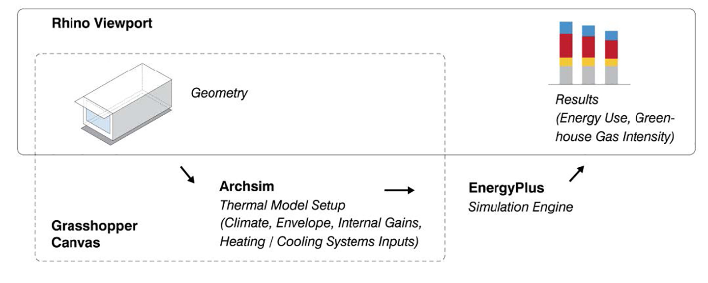
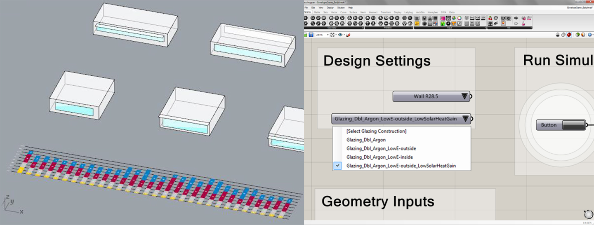

* TOC
{:toc}
{:.sidebar}

# Lessons learnt from a simulation-based approach to teaching building science to designers
---

[Full paper](http://www.ibpsa.org/proceedings/BS2015/p2468.pdf)

**Reinhart, C.F., Geisinger, F., Dogan, T., & Saratsis, E. (2015)**

*Building Simulation 2015: International Conference  
of the Building Performance Simulation Association  
Hyderabad, India, December 2015  
pp. 1126-1133*

## Abstract

This manuscript describes lessons learnt over the course of several years of teaching building performance simulation to architectural students as part of an introductory building science class. Over the course of a term, students are exposed to a design analysis workflow that links architectural massing models in Rhinoceros 3D to Radiance/Daysim and EnergyPlus. Starting with direct shading and window- to-wall ratio studies, the students tackle increasingly complex tasks which culminate in a 90-min simulation game. For the game students compete in pairs to design a 3000m2 office building with the lowest greenhouse gas emissions per floor area in Phoenix, AZ. Playing the game with a class of 18 undergraduate and graduate students during the fall of 2014, eight teams managed to prepare and run between 9 and 53 design variants with final emissions varying between 37 and 64 kgCO2e/m2. The act of learning while playing proved to be an effective way to intellectually engage the students and help them to discover best sustainable design practices for the investigated building type and climate by themselves.

## Introduction

Design practice and education have long gone digital. A mere decade ago this statement would have implied that design outputs such as construction documents, plans, sections and perspective drawings are being generated from a CAD or BIM model. However, with the rise of parametric tools and digital fabrication techniques, the very process of how and what gets designed has changed. The capability to rapidly generate thousands of design variants has led to new questions of how to evaluate then in tandem with aesthetical concerns. To address this question, design tools have been linked to building performance simulation (BPS) programs enabling users to quantify the thermal, lighting and structural performance of a design proposal with minimal effort (e.g. Lagios et al., 2010; NREL, 2015; Karamba, 2015). A building energy analysis that used to take a specialist consultant days to prepare can now be generated from schematic design-phase models within minutes. In 2012, the American Institute of Architects (AIA) released an “architect’s guide to integrating energy modelling in the design process” that explicitly encourages AIA
members to adopt such simulation workflows to enhance the performance of their designs (AIA, 2012). What are the consequences and potential pitfalls of this trend?

Several years ago, the authors argued that “being able to read thermal simulation results and to adapt one’s design accordingly has become an essential skill for graduating and practicing architects” (Reinhart, Dogan, Ibarra and Samuelson, 2012). In order to enforce this skill set, the authors originally developed and tested a 90-min in class exercise during which participants were asked to identify the building with the lowest Energy Use Intensity (EUI) out of a large parametric set of design options. At the time, the game setup required a group of players (architecture students) and a support group of “simulation experts” with training in BPS to simulate the design proposals brought forward by the players. The task of the players was to understand and react to a proposal’s simulated monthly heat balances and fuel uses and to iteratively come up with new design proposals until the game time was up. Since the game itself took only 90 minutes, the exercise could be conveniently inserted into a conventional NAAB-required environmental technologies class as is being taught across North America in accredited architecture programs (NAAB, 2015). The reception of the original game as a mode of engaged learning was very positive among the students. The main complaints with the game were that no gaming strategy was provided how to systematically react to simulation results and that the range of efficiency measures provided was too extensive for the limited amount of time given, leading to a fair amount of guesswork. The authors further noted that the game, apart from its direct learning outcomes, also fulfils the role of a “teaser”, prompting interested students to take more advanced BPS classes, as they are increasingly being offered at schools of architecture and/or collaborating engineering departments. Depending on the popularity of these advanced classes, such activities may create a local energy modelling culture that promotes the use of BPS tools in design.

Since the writing of that paper, a rising number of schools of architecture have invested into analysis tools that directly link BPS to design environments, increasing the number of architects who are being trained in this domain. Nevertheless, given the widely perceived notion that climate change mitigation deserves society’s full attention along with the pivotal role that buildings play within this process, one may question whether the current rate of adoption of PBS in architectural practice and education suffices. Can society afford that only a fraction of architects and urban planners practice the use of evidence-based, sustainable design methods in favour of less specific rules of thumb? To fully address this question, it has to be shown that (a) architecture students can learn how to use PBS tools effectively within the time constraints of an introductory building technology class and that (b) the students’ resulting designs are superior to those that would have been created in the absence of these tools. In order to demonstrate these two points, the manuscript describes the evolution of the original simulation game into a broader pedagogical approach in which building physics concepts are taught through a series of simulation exercises that are based on design analysis workflows that link Rhinoceros3D (Rhino) massing models to Radiance, Daysim and EnergyPlus. The exercises are described below, followed by the outcomes and lessons learnt from applying them at the authors’ home institution.

## Methodology

### Simulation environment

All simulation exercises are based on the Rhinoceros 3d (Rhino) (McNeal, 2015) plug-ins DIVA (Jakubiec & Reinhart, 2011) and ArchSim (Dogan, 2013). DIVA is a simulation environment that supports a variety of design analysis outputs from physically-based visualizations using Radiance (Ward & Shakespeare, 1998) to annual daylight availability metrics using Daysim (Reinhart & Walkenhorst, 2001). ArchSim complements DIVA by offering multi-zone thermal modelling capabilities in EnergyPlus (Crawley et al, 2000) that are particularly geared toward load calculations for whole building massing models. While DIVA has components both in the Rhino viewport as well as in Rhino’s parametric scripting environment, Grasshopper (McNeal 2015b), ArchSim is purely Grasshopper based. As shown in Figure 1, this means that ArchSim models link a geometry in the Rhino viewport to a series of ArchSim components on the Grasshopper canvas. The component allow users to manipulate a variety of simulation inputs which are then sent to EnergyPlus. Simulation outputs are automatically displayed on the Rhino canvas. Since the writing of this paper an *Autozoner* algorithm has been added to ArchSim that automatically generates ASHRAE 90.1 Appendix G compliant multi-zone thermal models out of arbitrarily shaped massing models (Dogan, Reinhart & Michalatos, 2015). This feature was not fully functional during the time when the class was taught which is why all massing models were converted into single zone thermal models during the simulation game exercises 6 and 7 described below. The impact of this simplification on simulation accuracy will be evaluated below.

### Simulation exercises

A series of interlinked simulation exercises were developed, tested and refined over several years by the authors while teaching an NAAB required introductory, 14-week course to undergraduate and graduate students at MIT. The exercises presented in the following correspond to the Fall 2014 version of MIT 4.401 Architectural Building Systems. The class enrolment consisted of 12 undergraduate and 6 graduate architecture students. The undergraduate students were all in their first semester of architecture studies and also enrolled in a class that taught them advanced modelling concepts in Rhino. The graduate students were already familiar with Rhino at the beginning of the class. The very basic Grasshopper skills required for the ArchSim exercises were covered during weekly lab sessions. Table 1 shows an overview of the class and exercises. The complete syllabus is available from the authors’ web site.
A brief description of each exercise is presented below with an emphasis on the ones with a simulation component.

* **Exercise 1** was an exploratory, 500 word essay asking students to imagine their lives a decade from today “if everything goes well” and how their lifestyle choices will relate to concepts of sustainable living.

* **Exercise 2** was a DIVA-based exercise in which students had to model an existing three-dimensional object in Rhino and compare photographs of the object taken at two times in the day under clear sky conditions to DIVA/Radiance visualization of the same conditions.

{: .figure}
*Figure 1: Rhino viewport on the left with GH canvas and ArchSim on the right*{: .caption}

* **Exercise 3** required students to carry a data logger measuring temperature and relative humidity along with them for a week and to practice mapping “their life” on a psychrometric chart.

* **Exercise 4** consisted of modelling a 10m x10m x 3m, conditioned but unoccupied space with different insulation thicknesses and window configurations in Rhino and exporting it to EnergyPlus via ArchSim. Goal of the assignment was to introduce the students to the simulation workflow while also teaching them the impact of construction assemblies and window layout on the energy required to condition a space.

* **Exercise 5** was concerned with designing a 2.5kW PV system on a building located within a given urban context in Boston. System performance indicators were annual radiation maps and self-shading studies in DIVA/Radiance as well as monthly electricity yields in ArchSim/EnergyPlus.

For the remaining game-based exercises 6 and 7 a simplified ArchSim GUI was developed along with a results visualizer and archiver. The simplified GUI is mainly geared towards educational purposes and allows users to modify a controlled number of construction properties. Following each simulation, the visualizer automatically adds a new result to a bar graph along with a history of previous simulation results. Same as for the full ArchSim version, geometric parameters can be changed in the Rhino canvas whereas construction parameters are modified via pulldown menus in Grasshopper/ArchSim (Figure 2).

{: .figure}
*Figure 2: Envelope Game: The automated results display shows annual fuel uses for heating, cooling, lighting and equipment for each variant tested (left); the ArchSim file allows to change design setting for wall insulation and glazing type (right) *

* **Exercise 6** was an *Envelope Optimization Game* for which students had to design a very small (100m2) single story office building. The goal was to design the building with the lowest EUI by modifying building orientation, floor plan, insulation levels, glazing type and static shading design. All other design choices in Table 2 remained fixed to their defaults for this exercise. The game started during weekly lab time and lasted for an hour during which students were working in pairs. They were allowed to take the simulation exercise home and submit their results a day later. This was a key exercise to have students understand the relationship between solar gains, different glazing technologies, shading and resulting heating and cooling energy loads.

* **Exercise 7** was the main 90-min in-class midterm exercise. Students formed pairs and were asked to design a 3000m2 office building in Phoenix with the lowest greenhouse gas (GHG) emissions per floor area. The original game had used EUI as the deciding metric, mainly because these values are widely published. To sidestep the problem that EUIs for buildings with different fuel types (such as gas and electricity) somewhat mix “apples and oranges”, the decision in the original game had been to go with electric-only heating and cooling systems. For the new version, the authors decided to allow students to select between HAVC systems with different fuel types (Table 2) which triggered the choice to use GHG emissions as the driving metric. Same as for the original game, most baseline cases in Table 2 were chosen according to the ASHRAE 90.1-2007 Appendix G modelling protocol (ASHRAE, 2007). To avoid complications associated with modelling heat flows between the building and the ground, exterior floor surfaces were modelled as adiabatic.

In order to better introduce cost considerations into the game, different upgrades in Table 2 were assigned different *MIT$* cost premiums. The magnitudes of the individual costs were meant to facilitate a comparative analysis between different technologies. Their absolute value was normalized so that for a *typical* design proposal with all upgrades activated the cost premium would be around *MIT$100*. The admissible costs for a valid design submission for the game was *MIT$50* or less. This cost cap was imposed to encourage players to explore trade-offs and paybacks of different choices. To ensure students’ undivided attention throughout the game, the winning team was awarded 10 extra percentage credits towards their final course grade.

* **Exercises 8 and 9** were concerned with daylighting analysis and simulations, asking students to first explore a daylit classroom at MIT via subjective evaluations and through various photometric measurements followed by a simulation exercise 9 to a build a calibrated daylighting model of the space and compare it to a calibrated high dynamic range photograph (Reinhart, 2015).

As a final class project, the same teams worked again on an energy and daylighting concept for the Phoenix project but this time they had to balance resource efficiency with access to daylight and design aesthetics applying all analysis skills learnt throughout the class.

### Student presentations

Following the game, each student team was asked to present the logic that lead them from variant to variant as well as to comment on whether they felt that simulations helped them to improve the energy concepts of their designs or whether rules of thumb would have sufficed. They further had to comment on whether they trusted their results and if they would feel comfortable using their simulation skills in a studio environment or future practice.