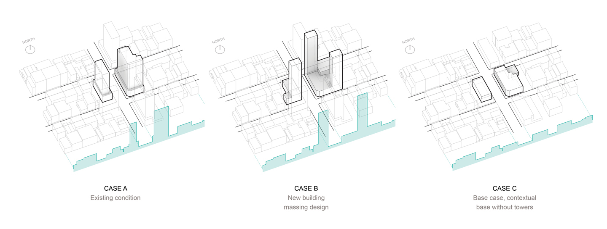
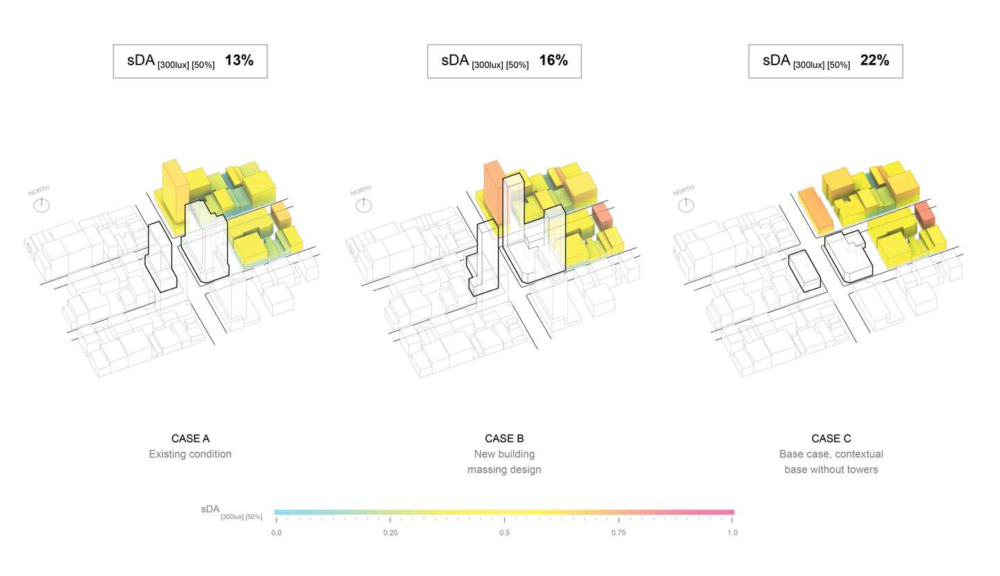

* TOC
{:toc}
{:.sidebar}

# Simulation-based daylighting analysis procedure for developing urban zoning rules
---

[Download full manuscript](https://dspace.mit.edu/bitstream/handle/1721.1/99254/922929038-MIT.pdf) 
[Download citation](https://www.tandfonline.com/action/showCitFormats?doi=10.1080%2F09613218.2016.1159850) 
[Purchase published manuscript](http://www.tandfonline.com/doi/full/10.1080/09613218.2016.1159850) 

**Saratsis, E., Dogan, T., & Reinhart, C.F. (2016)**  

*[Building Research & Information, Volume 45, Issue 5](https://www.tandfonline.com/toc/rbri20/45/5) 
[10.1080/09613218.2016.1159850](https://www.tandfonline.com/doi/full/10.1080/09613218.2016.1159850) *

## Abstract

Population growth and related space constraints have led to a planning paradigm that promotes living and working in high-density urban areas. Increasing urban density, however, leads to a conflict between space-use efficiency and access to daylight. To manage this conflict and to ensure sufficient solar access, cities have traditionally relied on zoning guidelines that propose simple, two-dimensional geometric evaluation techniques. This practice seems antiquated in times when computer aided design tools enable architects to test designs before construction. Recent advances in building performance simulation software allow us to compute annual climate-based daylight performance metrics of urban environments accurately, in high spatial resolution and in a timely manner. Given that zoning requirements as well as massing design decisions at the urban planning level may make or break the long-term daylighting potential of a whole neighborhood, the adoption of these tools by zoning boards and planners seems particularly relevant.

> This manuscript presents a simulation-based framework for formulating more nuanced prescriptive zoning rules, and a performance-based approach for developers and planners exploring innovative urban massing solutions.

The framework is used to evaluate the daylighting performance of common and innovative urban block typologies in New York City. The performance of the investigated massing designs varies; in some cases the designs significantly outperform existing strategies, supporting urban densities that are twice as high as current zoning maxima. Findings are illustrated using a case study and compiled into a set of recommendations for zoning boards, planners and real estate developers towards more sustainable management of solar access at the urban scale.

## Introduction

Urbanization and urban densification are ubiquitous trends worldwide [[United Nations, 2015]](#references). In established US urban centers, increasing densities are widely observed; from downtown redevelopment schemes, to infill projects in lower density areas as well as the densification of de-industrialized zones. The rationale for increasing density ranges from higher economic profitability to enhanced urban-scale sustainability by preserving land and resources, minimizing transportation footprint, and fostering socially cohesive urban communities [[Owen, 2009]](#references). A frequently-asked question is, apart from the parameters that justify density, what should limit it? It has been argued that contextual values such as historic patterns and social ties form part of the equation. Yet, equally crucial and recognized aspects are human well-being and the preservation of access to natural resources such as air and light both within buildings and at street level.

It seems self-evident that urban geometries have a significant impact on individual buildings’ access to natural light. Street orientation and width, surrounding building heights, and urban canyon characteristics all contribute to the amount of direct sunlight and diffuse daylight that a building facade receives. Given that these variables are unlikely to ever change, a site’s maximum build-able volume, prescribed in a city’s zoning ordinances, effectively determines the daylighting potential of all buildings in the affected jurisdiction in perpetuity. While architectural modifications to floor plans and sections, material choices and facade manipulations can either exploit this daylighting potential or choose to ignore it, the maximum possible daylight performance level of a neighborhood is decided upon at the zoning stage. How well do current zoning ordinances preserve access to daylight?

Across the world, the conflict between urban densification pressures and daylight access, has been addressed by cities through zoning resolutions. These resolutions usually propose simple, two-dimensional geometric evaluation techniques to ensure fair solar access to all buildings and streets.

> Although these resolutions are grounded in environmental concerns, they often seem rigid, inflexible, and even at odds with a city’s development potential.

Recently, developers in Manhattan and elsewhere have come up with creative ways to increase density. New prototypes with smaller footprints, increased environmental performance and sensitivity towards the established historical fabric have been presented in an effort to convince zoning boards to build higher, while limiting contextual impact. For example, a skyscraper proposal for West 57th Street recently approved by the NYC Landmark and Preservation Commission, features a contextual base that respects the architectural character of adjacent building facades, and a slender glass tower that rises to become one of the tallest structures in the United States. At the same time, citizen groups have been protesting new high-rise construction projects in the area [[Warren, 2013]](#references), claiming they would [‘cast mile-long shadows over Central Park’](https://www.nytimes.com/2013/10/29/opinion/shadows-over-central-park.html), a celebrated public amenity. It becomes apparent that controlling density in a highly desirable urban context can easily lead to conflict among different stakeholders. In order to productively contribute to such urban disputes, this research seeks to discover the equilibrium point for economically profitable, yet environmentally fair urban densification.

As an example, the framework is applied to New York City, an iconic center for both urban dwellers and developers. The city has been receiving high-density development pressures ever since the dawn of the 20th century. In fact, New York was the first city to implement solar access-inspired zoning laws as early as 1916. Since then, its zoning resolutions have been used as model manuscripts for cities around the world, while, internally, the ‘rights to natural resources’ have sparked a continuing passionate debate among developers and involved citizens. In the following section, in order to appropriately discuss this topic, we will present a short summary of the existing zoning framework as documented in the Zoning Handbook by the New York City Department of City Planning (NYDCP) [[NYDCP, 2011]](#references).

New York City’s Zoning Guidelines today are an evolution of the original document from 1916. Over the years, changes were introduced that reflected different schools of thought in urban planning. The original 1916 Zoning Resolution was provoked by the Equitable Insurance Building in Lower Manhattan. The intense overshadowing problem that this building caused, combined with imminent pressures for new housing development, triggered the creation of a then radical document that established height and setback controls and that served as a model for urban communities across the United States facing similar challenges. The next major Resolution was introduced in 1960, with a clear imprint of Le Corbusier’s [‘towers-in-the-park’](https://en.wikipedia.org/wiki/Towers_in_the_park) approach, advocating for vast open space on the ground level and vertical concentration of density in sparsely located towers. The resolution incorporated the concept of ‘incentive zoning’, trading additional floor area for public amenities. Over time, urban theories institutionalized by the 1960 Zoning Resolution fell out of favor and were instead viewed as counterproductive to the city’s vitality because they were disrupting the continuity of the streetscape. Recent revisions of the New York City Zoning Resolution, have hence aimed to offer a more responsive and sensitive approach to planning by encouraging mixed use development, protecting the character of historical neighborhoods, and broadening inclusionary zoning incentives for affordable housing.

The Zoning Handbook organizes New York’s metropolitan region into Zoning Districts, each with its own land use groups and sets of metrics governing maximum building envelope form, open space and parking requirements. It establishes district-specific regulations and provides illustrations of typical building forms that would be generated by them. In an ‘as-of-right’ development scenario, high-density zoning guidelines prescribe:

* **Tower-on-a-base typology:** This frequently proposed typology is vertically organized into two volumes with distinct formal properties: the contextual base, that rises to a prescribed ‘base height’ continuously following the street line, and the tower, that is set back from the street line and is required to have a large percentage of its floor area below a prescribed ‘tower height’.
* **Building envelopes defined by the sky exposure plane:** A sky exposure plane is defined as ‘a virtual sloping plane that begins at a specified height and rises inward over the zoning lot at a ratio of vertical to horizontal set forth in district regulations’. It is prescribed to provide light and air at street level.
* **Building height and setbacks defined by street width:** Two thresholds for street are defined: a narrow street (less than 75’ wide), and a wide street (more than 75’ wide). Based on the definition of the street, the buildings are required to have a 10’ or 15’ setback beyond the ‘base height’. The maximum building height is also frequently defined by the distance of the building from a wide street.
* **Floor area increases justified by provision of open space:** In certain settings, the provision of an ‘urban plaza’, an ‘open area for public use adjacent to a non-residential or predominantly non-residential building’, allows developers to increase the floor area of the building up to 20%. This area has to be unobstructed from its lowest level to the sky.

The zoning guidelines also include case-specific regulations for special projects that don’t conform to the ‘as-of-right’ category. The developers of these projects are usually asked to present overshadowing studies to the zoning boards, in order to prove that they don’t significantly limit solar access of surrounding properties.

This manuscript argues that the above described regulations of the NYC Zoning Board have a number of limitations. First, daylight access is presented as a concept tied to the streetscape. The constant densification of the city is eventually going to limit the daylighting potential not only on the street, but also for the interiors of buildings; the need arises to respond to this challenge as well. Second, although the district definition is detailed, form-generation guidelines for buildings largely remain decontextualized from the building’s particular surrounding. Current guidelines therefore have only limited means to adequately ensure fair access to daylight in more spatially complex conditions. Third, the zoning rules are climate- and orientation- agnostic, ignoring the amount of daylight that is available for different facades over the year. Fourth and foremost, despite a growing consensus on how to evaluate the daylight availability in a building, current guidelines do not specify the actually required daylighting performance for proposed urban geometries.

> This manuscript applies the latest generation of building-level daylight availability metrics at the urban scale.

Before reviewing these daylighting metrics, several previous studies concerned with daylighting access in neighborhoods are being reviewed.

Compagnon [[Compagnon, 2004]](#references) proposed a procedure to evaluate the daylight potential of buildings by obtaining irradiance values on building facades in order to compile thresholds that could identify ‘good’ designs. Although this approach is a good starting point, it neglects that daylight availability is highly dependent on building depth.

In later research, Strømann-Andersen et al. [[Strømann-Andersen et al., 2011]](#references) accounted for building depth by analyzing typical street canyons in section. Their research examined the relationship between building-scale, passive energy factors and urban density and established the interrelation between urban geometry and building operational energy. This mostly 2D approach is however only applicable to urban settings that are homogeneous in height and that are predominantly consisting of street sections that can be approximated as infinite extrusions. For high-density environments with tower typologies this methodology can’t be applied.

Cheng et al. [[Cheng et al., 2006]](#references) introduced a three-dimensional approach to examine the relationship between density and daylight availability. By cross-referencing daylight factors and plot ratio, their research aimed to identify performance trends and to relate them to geometric attributes of models. This study revealed the potential of daylighting simulations for urban design decision-making. However, it has to date only been applied to a very limited set of urban models and the daylight factor, that was used by the author, is not a climate-based metric.

Climate-based daylighting metrics have been investigated and promoted by several groups for a number of years. Over the past decade several research groups have promoted the so-called climate based daylighting metrics that are based on annual series of hourly indoor illuminance calculations [[Nabil et al., 2006]](#references)[[Reinhart et al., 2001]](#references). In 2012 the Illuminating Engineering Society of North American (IESNA) introduced Lighting Measurement protocol LM-83, that recommends the use of spatial daylight autonomy metric, sDA, to evaluate the daylight availability in architectural spaces [[IESNA, 2012]](#references). According to the LM-83, a point in a building can be considered to be “daylit” if at least half of the occupied time (50%) the work plane illuminance at the point due to daylight is above 300lux (sDA(300lux)(50%)). In 2014, the United States Green Building Council (USGBC) adopted a version of LM-83 for it’s the daylighting credits in its LEED-v4 green building rating system [[USGBC, 2012]](#references). The sDA(300lux)(50%) target level for a space according to LEED-v4 is 55% of regularly occupied floor area.

In order to calculate spatial daylight autonomy distribution at the building levels, practitioner have traditionally relied on daylight coefficient based methods such as Radiance/DAYSIM. Radiance is a validated backward ray-tracer developed by Greg Ward at Lawrence Berkeley National Laboratory [[Ward et al., 1988]](#references). DAYSIM is a Radiance-based annual daylight simulation program that effectively predicts hourly time series of interior or façade illuminances [[Reinhart et al., 2006]](#references).

A barrier towards to use of a simulation tool such as DAYSIM for urban level analysis is the time required for model setup and simulation. Dogan et al. [[Dogan et al., 2012]](#references) therefore introduced a novel method called ‘Urban Daylight’. In order to speed up the interior illuminance calculation for urban level simulations, where interior floor plans and partitions are anyhow unknown, Urban Daylight uses DAYSIM to calculate hourly illuminance levels on discrete facade patches. An impulse-response method is then used to convert outside illumination levels into diffuse light propagation in the interior of a building. The sum of all façade impulses add up to hourly illuminance profiles across a floor-plate.

Building on this research, this manuscript presents a consistent procedure to evaluate daylight performance of urban massing models. The relationship of density and daylight availability is quantified in accordance with the above mentioned LM-83/LEED-v4 criterion sDA(300lux)(50%). The procedure is applied to 50 urban-scale massing examples and a set of recommendations for performance-based zoning is derived. The procedure may serve two purposes: Municipalities may use it to derive evidence-based, prescriptive daylight zoning laws, while designers and developers may use it to propose innovative massing concepts without compromising access to daylight.

## Methodology

The research that can be divided into two steps, test case generation and simulation-based evaluation.

### Test case generation and growing scheme

Modeling a neighborhood is a complex task. Among the first parameters that need to be defined is the spatial size and resolution of the test geometry. This choice is complicated because zoning and planning processes transcend multiple scales, from specific building envelopes to general zoning districts. This means that while the model has to be seen at the urban scale, the actual evaluation of local daylighting conditions require geometric detail down to the window and individual floor scale. Given these two requirements, the author decided to work at the resolution of the urban block as an intermediate scale bridging the gap between buildings and districts.

Block dimensions were 140m (450’) by 60m (200’) in line with typical dimensions of a high-density block in New York City. The detailed geometric parameter values are described in Table 1.

| Parameter | Value |
|:-- |:-- |
| Block Length | 140m (450') |
| Block Width | 60m (200') |
| Layer A (Base) Height Range | 3-6 levels (9-18m) |
| Layer B (Tower) Height Range | 1-50 levels (3-150m) |

*Table 1: Geometric parameter values*{: .caption}

{: .figure}

*Figure 1: Block typology diagram*{: .caption}

Five specific block typologies, which are frequently found throughout the city, were picked with diverse footprint types and levels of permeability at the ground level (perimeter, atrium, courtyard, alley, double alley). Each typology was then subdivided into two geometric layers with distinctive characteristics:

* **Layer A (Base):** The geometric expression of the ‘contextual base’ as defined in the NYC Zoning Resolution, it follows the ‘street line’ and defines the ‘street wall’.
* **Layer B (Tower):** The geometric expression of the ‘towers’ as defined in the NYC Zoning Resolution, they rise on top of the base and are completely contained within its footprint.

In order to work within a larger urban context, it was assumed that the investigated block would repeat itself across a neighborhood, meaning that the block typology under investigation was assumed to be surrounded by identical blocks leading to 3 by 3 block sized urban simulation models. The simulation context is shown in Figure 2. The choice to surround each block with its own kind was made to avoid an ‘export of problems’ outside of the simulated area of interest e.g. by building sets of high rises in a low-rise context. The street width was set to 20m (65’). Block orientation reflects New York City’s condition, with the short dimension aligned with the north-south axis.

{: .figure}

*Figure 2: Simulation context diagram*{: .caption}

A growing scheme was then developed to produce a variety of densities for each typology, while maintaining its essential formal characteristics. To quantify density, the author used the zoning metric floor-area ratio (FAR), prescribed in the New York Zoning Handbook as ‘the principal bulk regulation controlling sizes of urban geometries.’ FAR is defined as the ratio of total building floor area to the area of its zoning lot. The reference zoning lot area was the city block. Ten variants were then generated for each typology ranging from an FAR of 2.0 to 30.0. The variants are shown in Figure 3.

In order to emulate a realistic growing scenario there is a distinction between the base layer and the towers layer, each altered separately, as described in Table 1. This is a frequently observed scenario in New York City, where the base layer is usually made of a continuous array of buildings fronting the street with a consistent height of 3-6 levels, while the towers rise as slender volumes at different heights.

{: .figure}

*Figure 3: Block typology evolution matrix*{: .caption}

### Simulation setup

The daylight performance potential of the previously described 5*10 cases in the New York climate was simulated using ‘Urban Daylight’ [[Dogan et al., 2012]](#references). Based on hourly illuminance profiles, the program calculates the spatial daylight autonomy sDA(300lux)(50%) for each floor plate. Since this study is focused on the maximum daylight performance potential of a neighborhood, a window-to-wall ratio of 100% and glazing with a visible transmittance of Tvis 50% was applied. The Urban Daylight light transport mechanism form the façade into interior spaces relies on a diffuse distribution and hence models the equivalent of a 100% diffusing glass with Tvis 50%. The IESNA sDA specification also includes blind operations and prescribes to trigger blinds when 2% of the room area is exposed to direct sunlight. Due to limitations in the control mechanisms in Urban Daylight, the author approximated the IESNA sDA specification with blinds with a 50% cut-off value that are triggered at 20,000lux or higher on the façade. The blinds operate independently on discrete façade patches with a width of 40cm. The floor-floor distance is set to an average of 3m. A detailed list of simulation parameters can be found in Table 2. Each of the urban block prototypes is simulated within a generalized context. The floor-floor distance is set to an average of 3m. A detailed list of simulation parameters can be found in Table 2. Each of the urban block prototypes is simulated within a generalized context.

| Parameter | Value |
|:-- |:-- |
| Ambient Bounces (AB) | 4 |
| Ambient Divisions (AD) | 1,024 |
| Ambient Super-Samples (AS) | 512 |
| Ambient Resolution | 256 |
| Ambient Accuracy (AA) | 0.2 |
| Occupancy hours | 8:00am - 6:00pm |
| Sampling distance inside | 0.5m |
| Blind trigger point | 20,000lux |
| Facade window-to-wall ratio | 100% |
| Glazing type | Tvis 50%, 100% diffuse |

*Table 2: Simulation parameters*{: .caption}

## Results

Figure 4 presents a visualization matrix showing urban block density evolution with individual floor plates false-colored based on daylight availability levels. Predictably, the figure reveals a steady decline in daylight availability for the lower floors of the typologies as the density increases. Another common characteristic are good daylighting levels at the top floors of the towers across all typologies. The different color patterns for each block solution reflect the unique geometric features of each case.

{: .figure}

*Figure 4: Block typology evolution matrix with daylight availability mapped on floor plates*{:
.caption}

Figure 5 shows overall sDA(300lux)(50%) values as a function of FAR for all typologies. Different variations of the same typology are connected with colored curves. For further reference, the maximum allowable current FAR is plotted along with the LEED-v4 daylighting credit requirement. The latter is an approximation since it assumes that all areas across all floor plates are regularly occupied spaces which might not be true since the floor plates will necessarily include core and circulation spaces.  As mentioned above, the use of blinds is also being neglected. Working with these assumptions, only Typology A meets the LEED-v4 requirement for FARs up to 12.0.

{: .figure}

*Figure 5: Spatial daylight autonomy vs. Floor area ratio graph*{: .caption}

In order to better understand what these results might imply for a developer, Figure 6 plots absolute daylit area sizes based on sDA(300lux)(50%) for the five highest densities for each typology against floor area ratios. Assuming in this case that only the outer zones (5m distance) along the building façade areas count as 'regularly occupied spaces' according to LEED-v4, the gray dashed line represents the LEED-v4 sDA(300lux)(50%) 55% threshold line. Assuming a zoning law that follows LEED-v4, typologies lying above the gray line are considered 'daylit'. Typology B never meets the criterion. The maximum compliant variants for Typologies D, E and C are 3.5, 5.5 and 9.5, respectively, i.e. they are below the current maximum NYC FAR of 12.0. Typology A on the other hand tops out at an FAR of 24.1.

While Figure 5 demonstrates interesting relationships between urban density and overall daylit areas in various urban typologies, it does not reveal how even the daylight is distributed across the floor plates within each typology. As evident in Figure 4, lower floor plates tend to be worse daylighting performers in dense arrangements. Figure 6, therefore, shows how sDA(300lux)(50%) results are distributed among different floor plates. Variant B10 has 7 floor plates with an sDA(300lux)(50%) value above 90% versus 78 with a value below 10%, showing a strong daylighting imbalance across the typology. This indicates that zoning boards should specifically focus on the solar access of the lowest floors and the streetscape. Figure 6 also shows that the floor plates towards the lowest end of the performance spectrum tend to have a significantly negative impact on cumulative typology performance. Variant C8, for example, has 73 floor plates with an sDA(300lux)(50%) value above 90% versus only 14 with a value below 10%; they are, however, enough to drive its cumulative score down to 40%. This can be attributed to the fact that the lowest bin floor plates tend to be the ones with the largest area and the least exposure to daylight, usually making up the base layer. Such findings suggest the introduction of additional zoning regulations that ensure daylight penetration in deeper floor plates.

{: .figure}

*Figure 6. Matrix of floor plate performance histograms*{: .caption}

## Discussion

The previous section has shown that different urban typologies may have dramatically different daylighting performance according to the earlier presented LEED-v4 based neighborhood evaluation framework. What are the implications of this finding for zoning boards, planners, real estate developers and architects?

### Urban-scale daylight availability standards

Daylight access at the building scale has proven benefits for occupant health, visual comfort, aesthetics and operational energy use [[Reinhart, 2014]](#references). In order to ensure this access during design, LM-83/LEED-v4 promote an effective, new set of daylight availability metrics. As the same time, the recent partnership of the Congress for the New Urbanism (CNU) with the United States Green Building Council (USGBC) and the National Resource Defense Council (NRDC) to propose LEED for Neighborhood Development (LEED-ND), a [‘system for rating and certifying green neighborhood development’](https://www.usgbc.org/leed/rating-systems/neighborhood-development) [[USGBC, 2009]](#references) illustrates a growing desire to also systematically assess sustainability criteria such as daylighting at the urban scale. The LEED-ND 2009 standard, however, does not include guidelines for daylighting, probably because the calculation of sDA at the urban levels used to be to time and resource intensive to request.

> With the expansion of sDA calculations to the neighborhood level as presented above, a new procedure is now available that could be adopted by future version of LEED-ND.

Figure 6 indicates that it is insufficient to simply aim for averaged scores at the urban-scale and that it is instead advisable to also establish a lower bound for per floor plate performance scores to ensure that the lower floors will not fall below a certain threshold as densities increase. This could also be an indirect way of accounting for daylighting quality on the streetscape, a major public health debate point and an indispensable asset for a city’s vitality.

{: .figure}

*Figure 7. Spatial daylight autonomy vs. Floor area ratio graph with proposed threshold*{: .caption}

{: .figure}

*Figure 8. Daylit area vs. Floor area ratio graph*{: .caption}

### Zoning and urban development processes

As mentioned before, the LEED-v4 simulation based zoning framework can be used in two manners by both local zoning boards and urban designers:

* **Prescriptive zoning:** By evaluating the plotted curves of Figure 5 a zoning board can identify FAR ranges until which compliance with a set daylight availability limit can typically be maintained. Beyond this threshold, small increases in density tend to result in significant decreases in daylighting performance. Finding this threshold could help zoning boards to formulate evidence-based, geometry-sensitive and climate-specific FAR limits for prescriptive zoning laws.
* **Performance-based zoning:** Figure 6 further shows that some typologies have a wide densification margin at high daylighting performance levels. This means that whereas certain massing schemes reach their densification limit early on, others display higher potential for added area, meaning higher profitability rates for developers at a sustainable environmental cost. By using an alternative, performance-based compliance path to the zoning laws outlined above, developers could hence explore and further develop high performance design solutions.

> This approach would free them from the rigidity of traditional planning regulations and propose denser design schemes, provided that they meet prescribed performance criteria.

### Case Study: C6-4X Zoning District, New York, NY

In order to contextualize the impact of the research findings for New York’s Zoning Regulations, the author chose to demonstrate the suggested procedure on one of the city’s highest density zoning districts, coded C6-4X. According to the Regulations, C6 districts permit a wide range of high-bulk commercial uses requiring a central location, specifically corporate headquarters, large hotels, entertainment facilities, retail stores and high-rise residences in mixed buildings. The maximum FAR permissible in these districts is 10.0 to 15.0 under special conditions, accommodated in tower-on-a-base typologies, with a maximum height of 35 stories [[NYDCP, 2011]](#references).

For the purpose of this manuscript, the author chose to study two blocks within the C6-4X zoning district, located along 6th Avenue between West 26th and West 27th Streets. They acquired information regarding the fragmentation of these blocks into land parcels that reflect property boundaries. As shown in Figure 9, these blocks consist of small parcels along their long sides and one large parcel along their short side facing 6th Avenue. The scope of the analysis was limited to the large parcels, as they accommodate high density tower-on-a-base typology buildings (FAR 12.0) within a medium density broader context. The hypothesis was that a new building massing design with equal density but significantly better daylighting performance could be proposed using the proposed procedure for the aforementioned parcels.

{: .figure}

*Figure 9. Urban blocks, zoning districts, and land parcels*{: .caption}

To define the geometric attributes of the new building massing design, the author sought to abstract the formal characteristics of typology A, which significantly outperformed the other typologies in terms of daylight performance at high density as illustrated in Figure 7. They thus proposed a design with slender towers sparsely placed on a minimally obstructed contextual base, as described in Table 3 and illustrated in Figure 10. The contextual base height was set to 8 stories, and the tower height to 34 stories.

| Parameter | Value |
|:-- |:-- |
| Tower height | 34 stories (102m) |
| Tower length | 14m (46') |
| Tower width | 10m (33') |
| Base height | 8 stories (24m) |
| Floor-to-floor height | 3m (10') |

*Table 3. Geometric parameter values*{: .caption}

{: .figure}

*Figure 10. New building massing design within its urban context*{: .caption}

To evaluate the performance of the new building massing design (Case A) compared to the existing condition (Case B), the author employed the proposed procedure and focused on two metrics.

* **Contextual Obstruction (sDA(300lux)(50%) reduction for surrounding buildings):** In this process, a base case (Case C) was established, that consisted of the surrounding buildings and the contextual bases without towers. The sDA(300lux)(50%) was simulated for the surrounding buildings in the urban context for Cases A, B, and C according to the simulation settings described in Table 2. Then the reduction in Spatial Daylight Autonomy (sDA(300lux)(50%)) for Cases A and B against Case C was calculated (C-A compared to C-B).

* **Daylight Availability (sDA(300lux)(50%)):** In this process, both cases were simulated within their actual urban context according to the simulation settings described in Table 2.

The simulation results were summarized in Table 4 and the setup for all 3 cases illustrated in Figure 11. Case B performed significantly better for both metrics.

{: .figure}

*Figure 11. Cases A, B and C within their urban context*{: .caption}

More specifically, Figure 12 illustrates the floor-average sDA(300lux)(50%) for contextual buildings in Cases A, B, and C. In Case C, without any high-density tower development, the contextual buildings reach a 22% daylight availability score. The addition of towers according to the existing zoning regulations in Case A, leads to a 42% reduction for the sDA(300lux)(50%) of contextual buildings, hinting to an intense overshadowing effect. In Case C, the new massing design of matching density still causes a 32% reduction of its neighboring buildings daylight exposure, yet manages to limit overshadowing by a significant 24% compared to Case A. This improvement can be attributed to the sparse placement of the high-density towers that allows for increased daylight penetration through the massing.

| Case | Contextual Obstruction | Daylight Availability |
|:-- |:-- |:-- |
| Case A | 13% (-42% from Case C) | 32% |
| Case B | 16% (-32% from Case C) | 51% |
| Comparison | 24% better in Case B | 60% better in Case B |

*Table 4. Case study results*{: .caption}

{: .figure}

*Figure 12. Contextual obstruction for cases A, B, and C*{: .caption}

On the other hand, Figure 13 illustrates sDA(300lux)(50%) mapped on floor plates for Cases A, B, and an improved Case B’. In Case A, the consistently deep floor plates of the existing massing design yield a relatively poor sDA(300lux)(50%) 32%. Case B appears to be more polarized, with the contextual base reaching low daylight availability levels around sDA(300lux)(50%) 20%, while the towers remain consistently above sDA(300lux)(50%) 65%. The cumulative daylight availability score of the new massing design is 60% better Case A. To further illustrate the effectiveness of the proposed procedure, the author proposed an improved matching density design (Case B’), with a 10-story high contextual base and 14m (45’) by 14m (45’) atriums that reached sDA(300lux)(50%) 56%, outperforming Case A by 75%. In terms of daylit area, the improvement for Case B’ (8,745 m2) over Case A (5,542 m2) indicates that the proposed design yields higher quality spaces, hinting to increased profit margins for developers.

{: .figure}

*Figure 13. Daylight availability mapped on floor plates for cases A, B, and B’*{: .caption}

This case study showed that applying the proposed procedure to refine high-density building massing design, yields prototypes with reduced impact on the solar access levels of the surrounding buildings, increased daylighting performance, and improved real estate potential.

> These results could justify the application of the proposed procedure towards informing and expanding the New York Zoning Resolution in the future.

## Conclusion

In this manuscript, the author started with the premise that daylighting potential of buildings is an urban-scale challenge. After presenting the history of the conflict between urban density and solar access from a zoning regulation and a research-based perspective, they presented a novel, LEED-v4 simulation-based methodology to establish daylight zoning law and showed its relevance for zoning boards, urban planners, and real estate developers. The author believes that this methodology will allow stakeholders to make more informed, performance-aware decisions regarding solar access at the urban scale.

## References

* Cheng, V., Steemers, K., Montavon, M., & Compagnon, R. (2006). Urban form, density and solar potential. International Conference on Passive and Low Energy Architecture, 23.

* Compagnon, R. (2004). Solar and daylight availability in the urban fabric. Energy and Buildings, 36:4, 321-328.

* Congress for the New Urbanism. (2009) LEED for Neighborhood Development. [https://www.cnu.org/our-projects/leed-neighborhood-development](https://www.cnu.org/our-projects/leed-neighborhood-development)

* Dogan, T., Reinhart, C.F., & Michalatos, P. (2012). Urban daylight simulation: Calculating the daylit area of urban designs. SimBuild 2012.

* Illuminating Engineering Society of North America, Daylighting Metrics Committee. (2012). Lighting Measurement #83, Spatial Daylight Autonomy (sDA) and Annual Sunlight Exposure (ASE). IESNA Lighting Measurement. New York, NY.

* Mardaljevic, J., Heschong, L., & Lee, E. (2009). Daylight metrics and energy savings. Lighting Research and Technology 41:3, 261-283.

* Nabil, A. Mardaljevic, J. (2006). Useful daylight illuminances: A replacement for daylight factors. Energy and Buildings, 38:7, pp. 905-913.

* New York City Department of City Planning (2011) Zoning Handbook, 2011 Edition. New York, NY.

* Owen, D. (2009). The Green Metropolis: Why living smaller, living closer and driving less are keys to sustainability. Riverhead Books, New York, NY.

* Prudential Douglas Elliman Real Estate (2010). The Douglas Elliman Report: Manhattan 2001-2010. New York, NY.

* Reinhart, C.F. (2014). Daylighting Handbook I. Cambridge, MA.

* Reinhart, C.F., Mardaljevic, J., & Rogers, Z. (2006). Dynamic daylight performance metrics for sustainable building design. LEUKOS 3:1, 1-20.

* Reinhart, C.F., & Walkenhorst, O. (2001). Dynamic RADIANCE-based daylight simulations for a full-scale test office with outer venetian blinds. Energy and Buildings, 33:7, 683-697.

* Reinhart, C.F., & Weissman, D. A. (2012). The daylit area–Correlating architectural student assessments with current and emerging daylight availability metrics. Building and Environment, 50, 155-164.

* Strømann-Andersen, J., & Sattrup, P. A. (2011). The urban canyon and building energy use: Urban density versus daylight and passive solar gains. Energy and Buildings, 43:8.

* United Nations, Department of Economic and Social Affairs, Population Division. (2012). World Urbanization Prospects, the 2011 Revision: Highlights. New York, NY.

* United States Green Building Council. (2009). LEED 2009 for Neighborhood Development Rating System. Washington, DC.

* United States Green Building Council. (2012). LEED-v4 Daylight. [https://www.usgbc.org/credits/healthcare/v4-draft/eqc-0](https://www.usgbc.org/credits/healthcare/v4-draft/eqc-0)

* Ward, G. and Rubinstein, F. (1988). A New Technique for Computer Simulation of Illuminated Spaces. Journal of the Illuminating Engineering Society, 17:1.

* Warren, J. (October 28, 2013). Shadows over Central Park. [https://www.nytimes.com/2013/10/29/opinion/shadows-over-central-park.html](https://www.nytimes.com/2013/10/29/opinion/shadows-over-central-park.html)
