* TOC
{:toc}
{:toc_levels 1..2}
{:.sidebar}

# The optimization potential of floor-plan typologies in early design energy modeling
---

[Download full manuscript](http://www.ibpsa.org/proceedings/BS2015/p2455.pdf)

**Dogan, T., Saratsis, E., & Reinhart, C.F. (2015)**

*Building Simulation 2015: International Conference  
of the Building Performance Simulation Association  
Hyderabad, India, December 2015  
pp. 1853-1860*

## Abstract

Based on a consensus in the field that energy modeling should be applied as early as possible in the design process to maximize its impact on important design decisions, multi-zone thermal simulations are now used with increasing frequency in the earliest design stages. In the massing model phase, when the interior subdivision of a building is yet unknown, zoning standards such as ASHRAE 90.1 Appendix G assist modelers by prescribing a subdivision scheme with core and a consistently deep perimeter regions along the facade. This scheme, however, hardly ever resembles actual interior space subdivisions and thus raises the question of accuracy and usefulness of such simulations. This manuscript hence analyzes the significance of interior subdivisions on simulation results by thoroughly comparing the energy use intensity (EUI) levels for a representative set of floor-plans against the ASHRAE-prescribed zoning scheme. A sample set of 1200 simulations reveal a RMSE of 15% for total EUI but also reveal a RMSE of 175% and 105% for predicted heating and cooling loads. This suggests that the ASHRAE zoning scheme has only limited applicability for early design energy optimization.

## Introduction

For decades modelers have implemented multi-zone thermal models to simulate the energy use of buildings and inform the design and construction process. It is widely acknowledged that the earlier such simulations are used within a project, the greater their impact can be on important design decisions [[de Wilde et al., 2002]](#references). The recent integration of simulation tools into design software, as well as the implementation of automated thermal zoning algorithms [[Smith et al., 2011]](#references) [[Dogan et al., 2015]](#references) that can instantly build up multi-zone energy models with envelope and core area divisions according to ASHRAE 90.1 Appendix G [[ANSI/ASHRAE/IESNA, 2013]](#references) have led to fluid and interactive design workflows [[Dogan, 2013]](#references) [[Roudsari et al. 2013]](#references) [[Lagios et al. 2010]](#references). As a consequence, designers can now use energy modeling workflows with minimum effort.

This situation provokes the question of how useful these new workflows might actually be for designers. This might seem surprising to the reader given that the American Institute of Architects (AIA) specifically endorses the use of energy simulations by architects [[AIA, 2012]](#references) while the US Green Building Council’s LEED green building rating system provides credit for energy-simulation informed massing design [[USGBC, 2014]](#references). What could be the remaining limitations of current building energy simulation approaches for the design process? If specifics of interior floor plan layout are unknown, ASHRAE 90.1 recommends dividing floor-plates into a core and a consistently deep perimeter region along the facade. This subdivision scheme consequently shifts the attention towards the envelope and its properties in comparative studies. While this might be a good first approach to test the climate-responsiveness of a massing model, an important design optimization potential, the floor plan layout itself, is overlooked.

> An important design optimization potential, the floor plan layout itself, is overlooked.

In order to further understand the potential of floor plan layouts as energy efficiency measures, this manuscript explores the significance of interior subdivisions for simulation results. We compare a representative set of floor-plan typologies frequently found in architectural design literature with ASHRAE-prescribed thermal zoning models of the same floor-plates. We also show how iterating through several subdivision schemes offers a great potential to lower the intrinsic energy consumption of a design proposal.

## Methodology

The methodology is organized into two distinct phases: **sorting** and **modeling**. In [Phase 1](#phase-1-sorting) we present a process of typological sorting for floor plans based on their exterior shape and interior organization. This process leads to the creation of a comprehensive floor plan typology matrix with samples from contemporary architectural design literature. In [Phase 2](#phase-2-modeling) these samples are translated into energy models based on two zoning paradigms:

* **Paradigm A:** Zoning that strictly follows the form of the architectural plans
* **Paradigm B:** The ASHRAE 90.1 Appendix G - prescribed core and perimeter subdivision scheme

We then carefully compare the simulation results of both zoning paradigms.

## Phase 1: Sorting

The initial challenge of our study is to develop a representative set of building samples that reflect the typological richness of floor plan designs found in contemporary architectural design. This is a non-trivial task, since the choice of samples to be analyzed is, to an extent, ambiguous and is expected to have a significant impact on the simulation results. In order to respond to this challenge, we introduced a two-level process of typological sorting process for building floor plans:

* **Level 1:** Exterior shape
* **Level 2:** Interior organization

With our categorization scheme we combine and consolidate different typological sorting methodologies found in contemporary architectural design theory literature [[Neufert, 2012]](#references) [[Jocher, 2010]](#references) [[Schneider, 2011]](#references) [[Ebner, 2010]](#references). We also rely on the previously mentioned sources for the selection of the built examples.

### Level 1: Exterior shape

The first level of sorting is the exterior shape of a building design. The general shape and proportions of a building, reflecting functional characteristics, contextual conditions and environmental considerations can vary significantly. The reoccurrence of certain patterns, however, allows us to sort designs into discrete typologies. We identified five popular exterior shape typologies that are described in detail in Figure 1:

{: .figure}
*Figure 1: Exterior shape typologies*{: .caption}

* **Point:** Compact shape for both housing and office use often organized with a core in the center or on the side. This shape typology can be appointed in several scales, ranging from single-family houses to office towers.
* **Block:** Economic and space-efficient layout unifying different spatial qualities: protected, quiet inner courtyards and outward-oriented spaces. This duality allows for multiple spatial distribution options based on different programmatic requirements.
* **Line:** Shape that is made up of a series of rooms organized along a longitudinal corridor or multiple corridors. Well daylit for a single loaded corridor but less economical. Double or triple loaded corridors less likely to be naturally lit.
* **Poly-line:** Similar to the line typology with a mostly linear organization along a longitudinal corridor with varying angles and segment lengths.
* **Freeform:** Shape reacting to contextual conditions or a freestanding solitaire. Facilitates design of non-conventional circulation space. Completion of the interior requires specific non-standard solutions.

### Level 2: Interior organization

The previously described shape typologies only describe the exterior appearance of a building and hence only indirectly speak to the floor-plan layout of a building. The interior organization is mostly driven by the way one enters a building and accesses the individual rooms within it. We identified five popular interior organization typologies that are described in detail in Figure 2:

{: .figure}
*Figure 2: Interior organization typologies*{: .caption}

* **Vertical Point:** Circulation core placed in the center or periphery of the building. The core can house only circulation space or can be designed more generously to incorporate common/shared spaces (e.g. living room/common space as circulation center).
* **Corridor Center:** Linear organization of spaces and services along a central circulation axis, that can often be long and narrow. Daylighting can be a challenge for circulation spaces, due to their limited exposure to the facade.
* **Corridor Edge:** Linear organization of spaces and services along a peripheral circulation axis that can either be on the interior or the exterior of a building.
* **Compartments:** Complex 3-dimensional arrangements that might not repeat on every floor. This organization typology can’t be represented by lines, but by polygonal shapes generated by the placement of spaces. It is often combined with complex interior voids that span over multiple stories, such as atria or gardens.
* **Open Plan:** Organization typology without space dividers. Separation is subtle and the circulation areas are not designated, allowing for flexible programming and giving the impression of a generous space. Placed elements often encapsulate service spaces such as kitchens and restrooms.

### Typological matrix

Both exterior shape and interior organization describe high-level patterns that frequently reoccur in architectural designs regardless of the building function. Additionally, each exterior shape typology can in theory be freely combined with any interior organization typology and create an overwhelming amount of variants. In order to keep the scope of this analysis manageable we selected one built example for each possible combination of our typologies. We present the resulting samples in Figure 3.

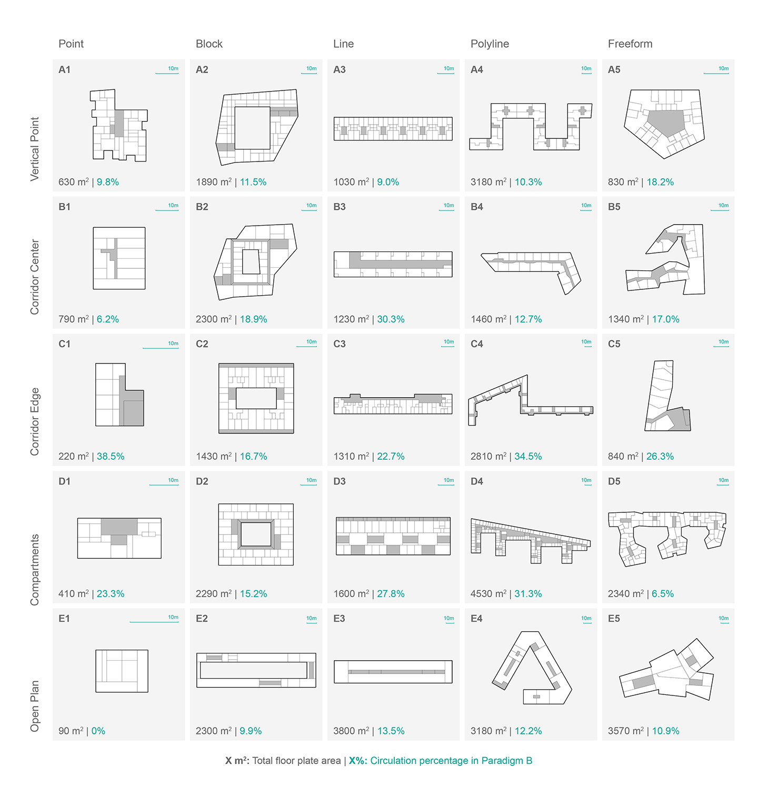{: .figure}
*Figure 3: Typological matrix of selected floor plans*{: .caption}

### Function & Scale

In our search for built examples we limit the selection to residential and office buildings. Since these are the most common functions appointed in an urban setting, we believe that this is sufficient to showcase the potential of the presented approach. Commercial and special use-cases such as schools, hospitals, and other institutional buildings are not analyzed but could be included in future work following a similar methodology. The function often also greatly influences the scale of a building. A point typology, for example, can range from a single-family home to a large office tower. We carefully select examples to reflect this variety ranging form a 90m2 single family home to a 3,800m2 office complex.

## Phase 2: Modeling

This phase presents how the thermal models are built, configured and compared. Firstly, the thermal zoning scheme for each subdivision paradigm is explained. This is followed by a description of the workflow to convert the zones into 3D multi-zone thermal model geometry. After the geometric setup, this phase also describes how the zone geometry is combined with zone specific properties such as materiality, loads and conditioning configurations. Lastly, the methodology to compare and analyze the simulation results is detailed.

### Zone geometry

The first zoning paradigm strictly follows the subdivisions prescribed by the architectural plans. The plan view of the zone subdivisions look identical to the plans given in Figure 3. It is important to mention however, that the 3D thermal model conversion workflow presented requires each zone to be represented by a closed-polygon outline.

The second zoning paradigm follows the ASHRAE 90.1 Appendix G recommendations. The brief guideline states that a floor should be divided into a ‘core’ and a ‘perimeter’ region. The perimeter is defined as the space within a 5m distance from the facade. Further, perimeter spaces with more than one orientation should be subdivided proportionally. The leftover region in the center of the floor forms the ‘core’ [[ANSI/ASHRAE/IESNA, 2013]](#references). In order to produce the core and perimeter geometry for all floor plans we utilized an automatic zoning algorithm [[Dogan et al., 2015]](#references). The algorithm uses straightskeleton subdivision and polygon offsetting to produce the ASHRAE 90.1 Appendix G compliant geometry. It yields closed polygons for core and perimeter of a given floor plan outline. The subdivision of the selected floor plans is shown in Figure 4.

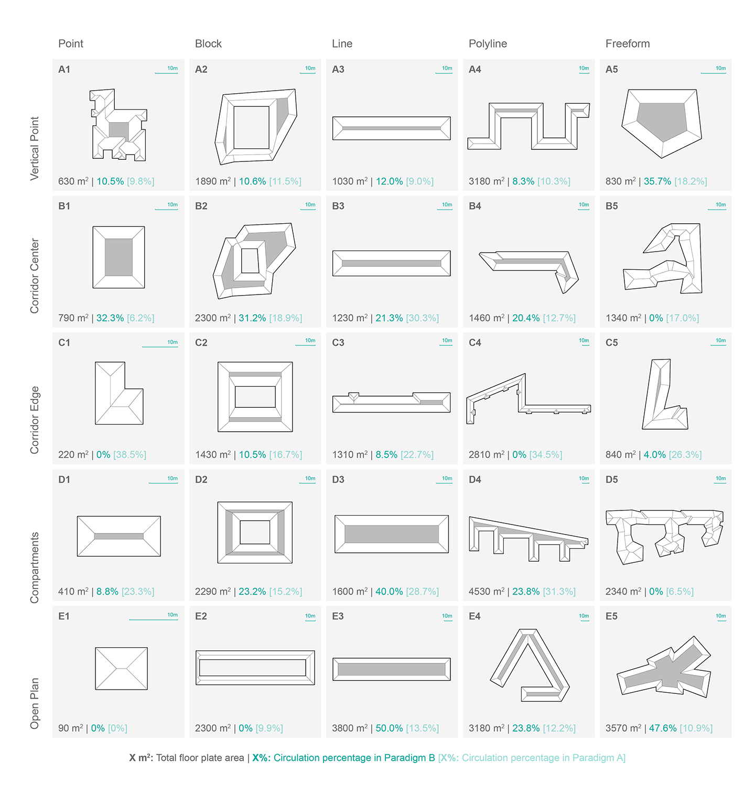{: .figure}
*Figure 4: Typological matrix with ASHRAE-prescribed zoning*{: .caption}

To construct the 3D thermal zone geometry we process the polygons that describe each zone and extrude them by a floor height 3m. The extrusion of the spaces yields the zone geometry for one floor. In order to emulate a roof, ground and middle floor, the zones are then stacked three times. A critical reader might object and note that not every building included in the floor plan matrix in Figure 3 is a three-story building. In this study however, the main focus is on analyzing the effect of different interior subdivision schemata on energy consumption. Hence, we did not intend to replicate the exact energy consumption and model representation of the selected buildings.

The window geometry is also automatically generated. We use the geometric inputs as follows: The floor-plan outline is shattered into small segments at each intersection with a zone wall. Then each segment is scaled and extruded to match a 50% window-wall ratio. We then position each window above a 1m high balustrade resulting in a window band at each floor that uniformly wraps around the building.

### Zone configuration

The zone configuration includes all non-geometric information on a thermal space such as constructions, space loads, occupancy and the configuration of the conditioning systems.

The construction standard is expected to influence the thermal behavior of each zone significantly. Hence, we test a well insulated and a poorly insulated scenario and the corresponding infiltration rates. We distinguish between construction types for the façade, roof, interior partition, exterior ground and interior slab and apply the constructions uniformly across all zones in the building.

Despite the zone geometry and its materiality, the use-case of each zone must be specified in order to define internal gains, occupancy and control profiles as well as equipment loads. For simplicity, the study is limited to circulation, residential and office space types. Each space type definition loosely followed the Swiss architectural norm SIA Merkblatt 2024 [[SIA, 2006]](#references) that defines the most common spaces and their internal gains, equipment loads, set-point temperatures and occupancy profiles. Each space is conditioned with an ideal-unlimited heating and cooling system with a coefficient of performance of 1, in order to obtain ‘pure’ loads as they occur in space. It is assumed that the spaces are fully conditioned all-year round. The only exception is the circulation space, which is tested in a conditioned and unconditioned configuration.

In order to consistently describe the thermal behavior for each model we limit this analysis to the EUI and its components: Heating, cooling, lighting and equipment loads. The loads are given in KWh and are normalized by floor area.

### Merging the data and running the simulations

The final task before the simulations are initialized is to combine the previously described parameters with the zone geometry. The geometric and non-geometric input data is hence organized in matching data-tree structures and then streamed to the energy modeling interface called Archsim [[Dogan, 2013]](#references). Archsim is a building energy modeling plugin for Rhino/Grasshopper [[McNeel, 2012]](#references) that utilizes EnergyPlus [[DOE, 2012]](#references) or TRNSYS [[Klein, 1979]](#references). The use of Grasshopper and Archsim allow us to completely automate the Energy Plus input file production and batch execution of the simulations. For the five by five matrix with two subdivision schemes, two different use-cases, two different conditioning modes of circulation space and two different construction standards the automated procedure generates 400 energy models. Since each subdivision and space configuration scheme is expected to behave differently in different climates the process is repeated three times with a cooling-dominated (Phoenix weather), heating-dominated (Anchorage weather) and a mixed climate (Boston weather) resulting in a total of 1200 Energy Plus simulations.  For each of the simulated scenario we then compare the behavior of the two subdivision paradigms. An overview of the workflow and its information flow is given in Figure 5.

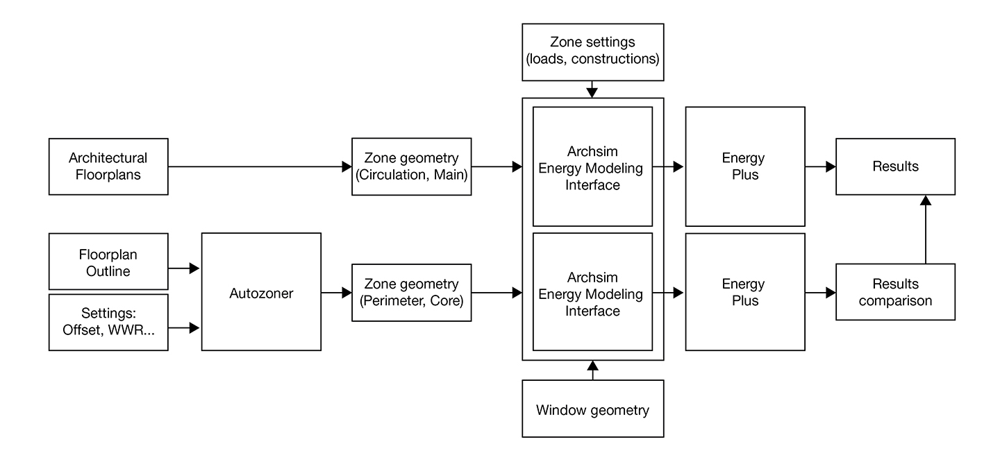{: .figure}
*Figure 5: Workflow diagram*{: .caption}

## Results

The previously described simulations yield 1200 energy loads data sets consisting of 600 pairs that describe one building in ASHRAE 90.1 subdivision and the buildings original floor plan. In a post-processing step we compute the percentage error E=((xAHSHRAE - xREAL) / xREAL) of the total EUI and its fours components: Lighting, electric, heating and cooling loads. We plot the computed errors in a distribution chart with 10% bins ranging from positive to negative 100%. The error distribution for the total EUI is given in Figure 6.

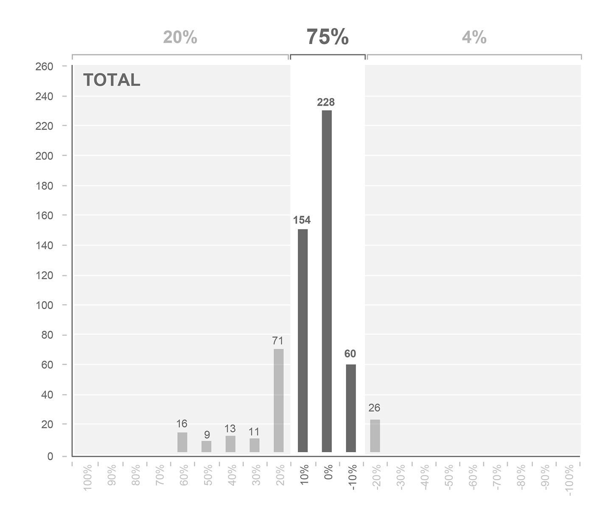{: .figure}
*Figure 6: Distribution chart of total EUI error*{: .caption}

The distribution chart shows that 75% of the simulated EUI predicted by the ASHRAE zoned models lies within a  +-15% margin. The distribution of the error of the EUI components is given in the Figures 7-10. Here the spread in the distribution chart is significantly wider. For predicted electric lighting only 33% are within the bounds of +-15%. For electric equipment, heating and cooling only 50%, 67% and 58% respectively lie within the margin.

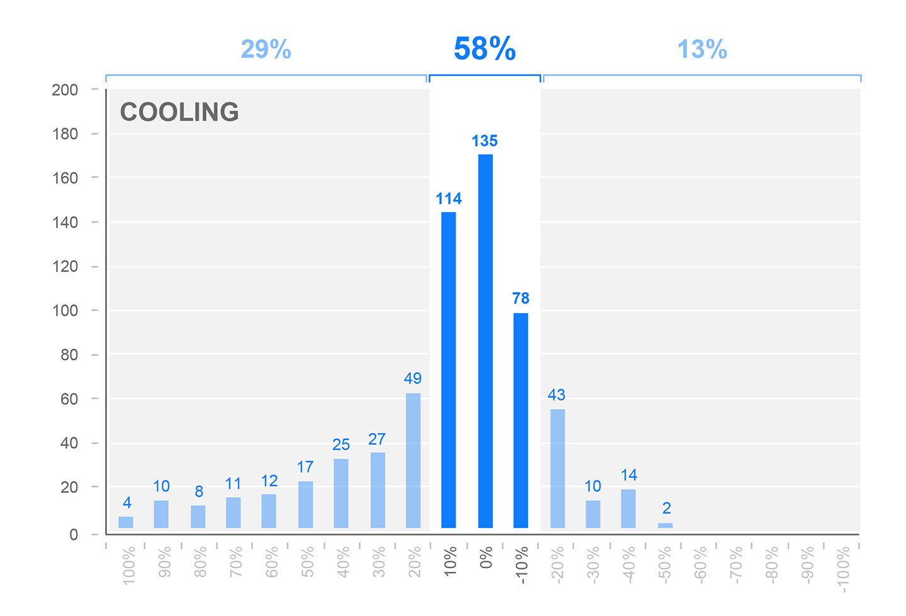{: .figure}
*Figure 7: Distribution chart of cooling load error*{: .caption}

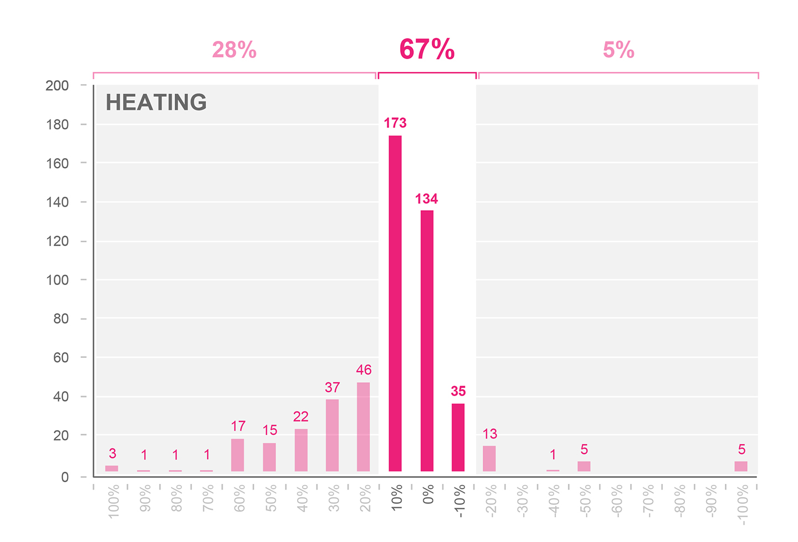{: .figure}
*Figure 8: Distribution chart of heating load error*{: .caption}

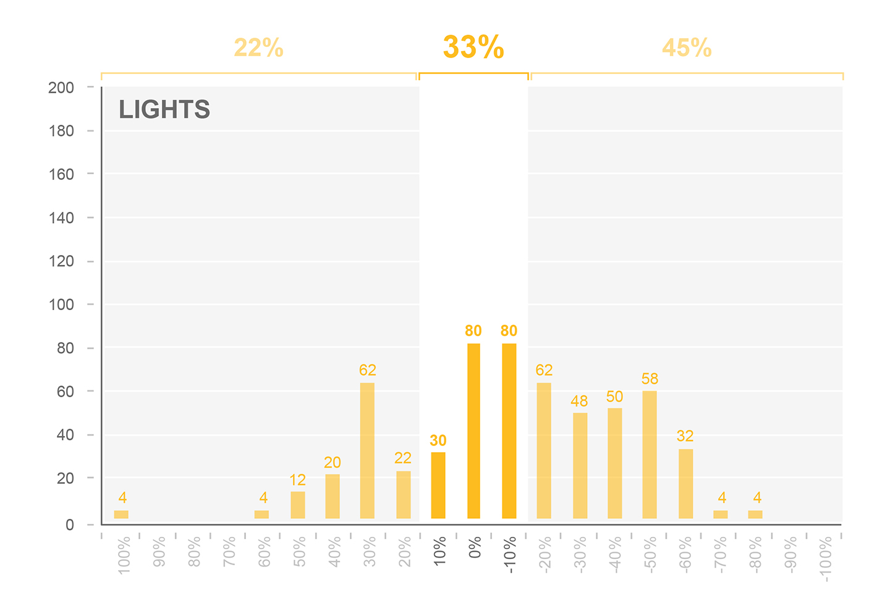{: .figure}
*Figure 9: Distribution chart of electric lighting error*{: .caption}

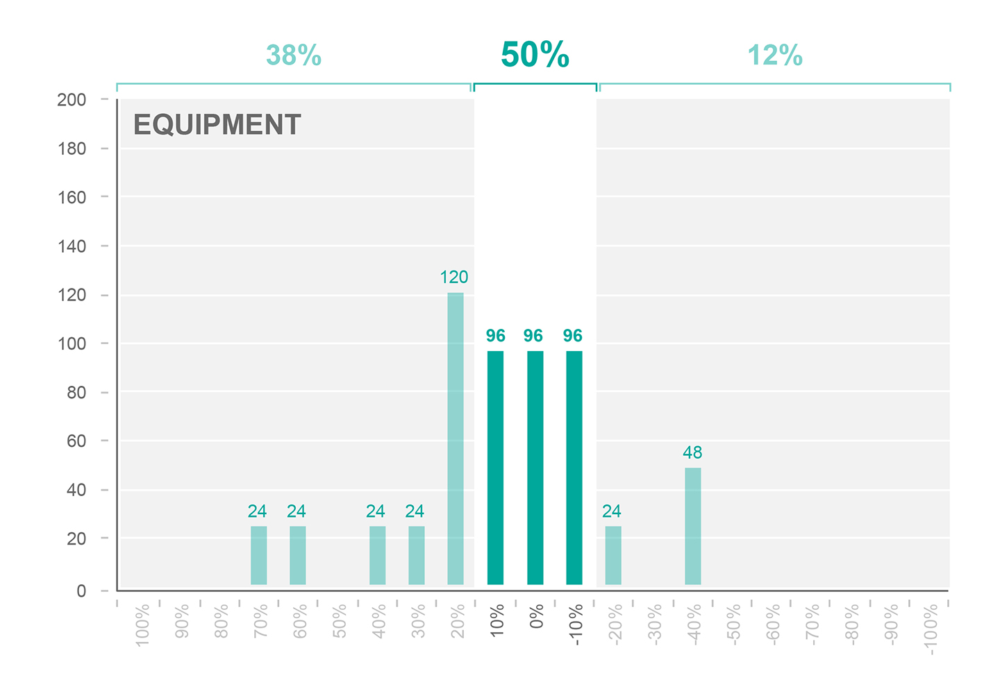{: .figure}
*Figure 10: Distribution chart of equipment load error*{: .caption}

We also compute the RMSE of the total EUI and its components over all scenarios for each floor plan in order to see a relationship between error and the actual geometry. The result is given in Figure 11. It is interesting to note that floor plans such as B3, D4 and D5 report significantly smaller errors than others. This is mostly due to the geometric similarity of the architectural plan and the ASHRAE subdivision in these specific cases where both variants have similar size core regions. One should also note that similarities in topology do not guarantee consistent results between the two subdivision paradigms. A good example that showcases this effect is case E3. Here the core and perimeter regions are almost identical topologically but differ significantly in proportion and uncle cause heating and cooling predictions that differ 124% and 265% on average throughout all scenarios. Floor plans with circulation at the edges (Typologies C1-C5) instead of a central corridor have a tendency to produce significant deviation between the two zoning paradigms. Here the circulation spaces serve as a thermal buffer zone and hence lower the predicted energy use. This effect is especially pronounced when the circulation spaces are unconditioned.

{: .figure}
*Figure 11: RMSE plotted on the floor plan matrix*{: .caption}

In order to summarize all computed errors we provide an overview in Table 3 that plots overall RMSE for total EUI, lighting, electric, cooling and heating loads. We also show the mean bias error MBE and the minimum and maximum errors that were encountered in the data set. The overall RMSE and MBE are at 15% and 2%. However, the data also shows that the overall error is significantly lowered by balancing errors in the EUI components. The overall RMSE and MBE are significantly higher for heating cooling and lighting. The minimum and maximum show that there are extreme outliers in the data set.

|          | Component     | Value
|:---      | :---          | :---
| **RMSE** | **Total**     | **+15%**
|          | Equipment     | +24%
|          | Lighting      | +37%
|          | Heating       | +175%
|          | Cooling       | +105%
| **MBE**  | **Total**     | **+2%**
|          | Equipment     | +3%
|          | Lighting      | -15%
|          | Heating       | +32%
|          | Cooling       | +22%
| **MIN**  | **Total**     | **-29%**
|          | Equipment     | -43%
|          | Lighting      | -84%
|          | Heating       | -100%
|          | Cooling       | -50%
| **MAX**  | **Total**     | **+58%**
|          | Equipment     | +61%
|          | Lighting      | +118%
|          | Heating       | +2,700%
|          | Cooling       | +1,250%

*Table 3: Summary of results*{: .caption}

## Discussion

The foregoing section demonstrated that the zoning paradigm recommended in ASHRAE 90.1 Appendix G for early design evaluations can lead to significant inconsistencies in the calculation of energy loads when compared to zoning that follows a real floor plan layout. With an RMSE of around 175% for heating and 105% for cooling this study suggests that the ASHRAE zoning paradigm only has limited applicability for early design evaluations. It shows that the architectural essence of a floor plan layout is only sufficiently captured for very specific building types and proportions. The assumptions proposed by this paradigm reduce the complexity of architectural design, but also reduce design’s potential to have a positive impact on energy efficiency. A typical example is the assumption that a building is always subdivided to core and perimeter regions, generated by a standard set of geometric manipulations. While using ASHRAE’s zoning paradigm might be a good first approach to test the climate-responsiveness of a massing model or a building envelope, the efficiency gain potential of the floor plan layout itself is overlooked. How could architects tap into this potential?

Unlike other architectural optimization workflows such as structural design or daylight optimization the relationship between energy and form has had the tendency to only provide a fuzzy and indirect sensitivity to morphologic changes of a design. The programmatic proportions and its spatial distribution within a design seem to have a significant influence on energy demand. We hence introduce a proof-of-concept floor plan optimization workflow. We test one floor plan shape with nine different subdivision variants that all maintain the same area for circulation and main use throughout the test.

Similar to the previous simulation setup the floor plan is tested for multiple climates, construction standards and use. A 20m by 60m floor plate is simulated with nine different subdivisions. The plans are shown in Figure 12. The zoning consists of a main use area and circulation that is kept constant at 150m2 per floor in all variants. The circulation area is visualized in light grey. A window-wall ratio of 50% is assumed for both the north and the south facade. The nine zoning variants are tested in the same 24 scenarios mentioned in the methodology section.

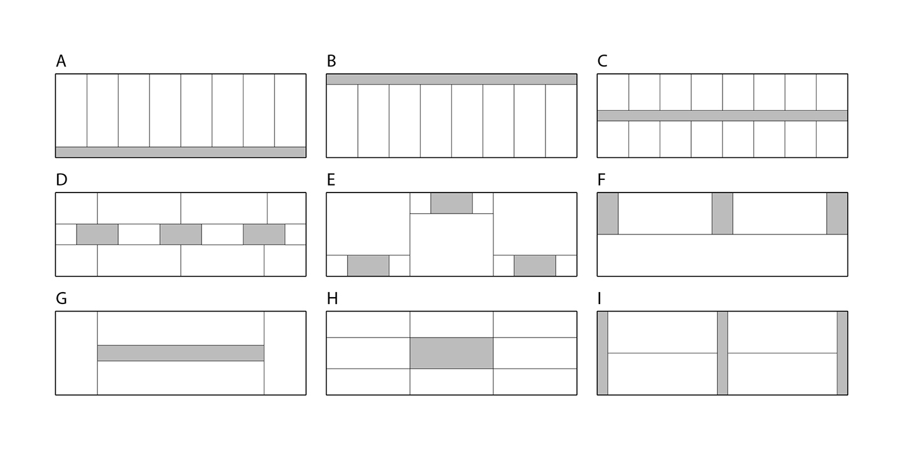{: .figure}
*Figure 12: Schematic design floor plan design variants with identical circulation area*{: .caption}

The difference in the results is significant. Figure 13 shows a load breakdown for one scenario. In this scenario the choice of the floor plan layout by itself can make or break the LEED credits achievable for building energy load reduction.

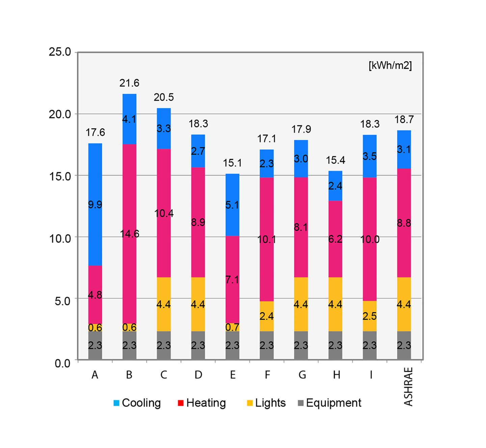{: .figure}
*Figure 13: Load breakdown for all variants in one simulation scenario*{: .caption}

In order to evaluate the variance in energy use intensity for all scenarios Figure 14 visualizes the delta of the minimum and maximum energy load among all nine floor plan variants. The delta is then normalized by the minimum-achievable-load.

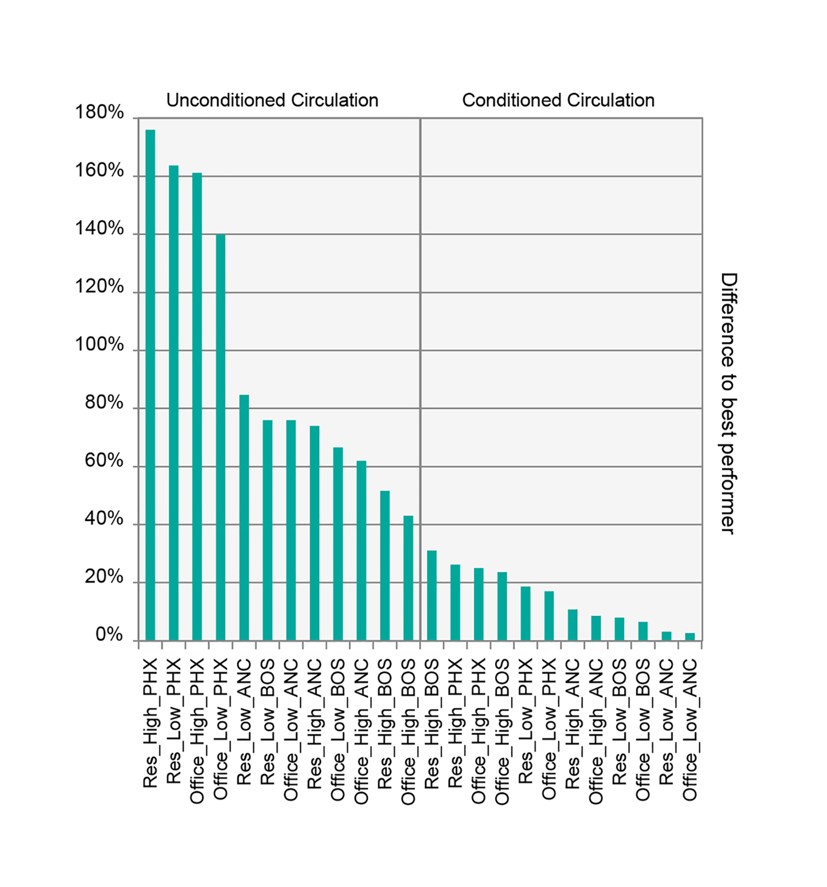{: .figure}
*Figure 14: Delta of the minimum and maximum energy load divided by the minimum achievable load*{: .caption}

As illustrated in Figure 14, the delta of the best and the worst performer within one scenario as high as 180% of the minimum achievable energy demand. One can thus safely infer that the floor-plan layout can have a significant influence on a building’s energy demand. This result sheds new light on the relationship between form and energy in general: whereas the traditional assumption has been that massing orientation and façade design have the greatest impact towards energy efficiency, this study extends the focus on another important parameter of the architectural design domain – the floor plan and its organization typology.

> This result sheds new light on the relationship between form and energy in general.

The previously presented results show that area proportions and location of the core area have to match only approximately in order to get closely matching results (Typologies A4, B3). Hence, this knowledge should be part of the thermal zoning considerations as early as possible. This would have different impacts based on the scale of its implementation:

* At the building scale, the embedding of these considerations could guide building form generation and the arrangement of spaces according to various organization typologies.
* At the urban scale, this level of detail might seem untimely. However, by implementing an architecturally conscious thermal zoning process early on, the developer of a master plan can tap into an additional energy efficiency potential that might be very valuable when defining performance and carbon footprint targets.

Ultimately, we believe that the architectural sensitivity demonstrated in the presented workflow could increase the interest of architects in actively pursuing efficiency measures and producing designs that creatively use the saving potentials of smart arrangement of spaces.

## Conclusion

This manuscript shows significant inconsistencies in predicted energy use intensity for the ASHRAE 90.1 Appendix G zoning paradigm when compared to the actual floor plan layout of a building. A significant energy optimization potential is revealed in the floor plan design process. The form-sensitive nature of the presented workflow could increase the interest of architects in energy modeling in general.

## Acknowledgements

The authors would like to thank Transsolar Energietechnik GmbH Munich and the Alexander S. Onassis Public Benefit Foundation for productive discussions and partial funding of this research project.

## References

* AIA (2012). The AIA Energy Modeling Practice Guide. Retrieved March 2015. [https://www.aia.org/resources/8056-architects-guide-to-integrating-energy-modeli](https://www.aia.org/resources/8056-architects-guide-to-integrating-energy-modeli)

* ANSI/ASHRAE/IESNA Standard 90.1-2013 Appendix G

* de Wilde, P., Augenbroe, G., & van der Voorden, M. (2002). Design Analysis Integration: Supporting the Selection of Energy Saving Building Components. Building and environment 37 (8–9): 807–816.

* DOE (2012). EnergyPlus Energy Simulation Software, V.7, [https://energyplus.net](https://energyplus.net)

* Dogan, T., Reinhart, C.F., & Michalatos, P. (2012). Urban daylight simulation calculating the daylit area of urban designs. Proceedings of SimBuild.

* Dogan, T. (2013). Archsim Energy Modeling Software. Retrieved November 2013. [http://www.archsim.com](http://www.archsim.com)

* Dogan, T., Reinhart, C.F., & Michalatos, P. (2015). Autozoner: an algorithm for automatic thermal zoning of buildings with unknown interior space definitions. Journal of Building Performance Simulation, (ahead-of-print): 1-14.

* Ebner, P. (2010). Typology+ Innovative Residential Architecture. Birkhäuser GmbH.

* Jocher, T., Loch, S., Lederer, A., Pampe, B., Gasser, M., zur Brügge, C., Tvrtkovic, M., Stamm-Teske, W., Fischer, K., & Haag, T. (2010). Raumpilot. Wüstenrot Stiftung

* Klein, S.A. (1979). TRNSYS, a transient system simulation program. Solar Energy Laboratory, University of Wisconsin—Madison.

* Lagios, K., Niemasz, J., & Reinhart, C.F. (2010). Animated building performance simulation (abps)-linking rhinoceros/grasshopper with radiance/daysim. Proceedings of SimBuild.

* Merkblatt, S.I.A. (2006). 2024: Standard-Nutzungsbedingungen für die Energie-und Gebäudetechnik. Zürich: Swiss Society of Engineers and Architects.

* McNeel, R. (2012). Grasshopper - Generative Modeling with Rhino, McNeel North America, Seattle, USA. [http://www.grasshopper3d.com](http://www.grasshopper3d.com)

* McNeel, R. (2012). Rhinoceros - NURBS Modeling for Windows (version 5.0), McNeel North America, Seattle, WA, USA. [http://www.rhino3d.com](http://www.rhino3d.com)

* Morbitzer, C., Strachan, P.A., Webster, J., Spires, B., & Cafferty, D. (2001). Integration of building simulation into the design process of an architectural practice. Proceedings of Building Simulation 2007: 7th Conference of the International Building Performance Association.

* Neufert, E., Neufert, P., & Kister, J. (2012). Architects' data. John Wiley & Sons.

* Pratt, K.B., Jones, N.L., Schumann, L., Bosworth, D.E., & Heumann, A.D. (2012). Automated translation of architectural models for energy simulation. Proceedings of SimAUD 2012: Symposium on Simulation for Architecture and Urban Design.

* Reinhart, C.F., Dogan, T., Jakubiec, J.A., Rakha, T., & Sang, A. (2013). Umi-an urban simulation environment for building energy use, daylighting and walkability. Proceedings of Building Simulation 2013: 13th Conference of International Building Performance Simulation Association.

* Roudsari, M.S., Pak, M., & Smith, A. (2013). Ladybug: A Parametric Environmental Plugin for Grasshopper to Help Designers Create an Environmentally-Conscious Design. Proceedings of Building Simulation 2013: 13th Conference of the International Building Performance Association.

* Schneider, F. (2011). Floor Plan Manual: Housing. Walter de Gruyter.

* Smith, L., Bernhardt, K., & Jezyk, M. (2011). Automated energy model creation for conceptual design. Proceedings of SimAUD 2011: Symposium on Simulation for Architecture and Urban Design.

* Treeck, C.V., & Rank, E. (2006). Dimensional reduction of 3D building models using graph theory and its application in building energy simulation. Engineering with Computers An International Journal for Simulation-Based Engineering, 23 (2): 109–122.

* US Green Building Council (2014). LEED rating systems. Retrieved November 2014. [http://www.usgbc.org/leed#rating](http://www.usgbc.org/leed#rating)
