* TOC
{:toc}
{:toc_levels 1..2}
{:.sidebar}

# Towards an energy simulation-informed design process: A 3-phase approach for a performative interdisciplinary laboratory building
---

[Full manuscript](http://www.ibpsa.org/proceedings/BS2015/p2265.pdf)

**Dogan, T., Saratsis, E., & Reinhart, C.F. (2015)**

*Building Simulation 2015: International Conference  
of the Building Performance Simulation Association  
Hyderabad, India, December 2015  
pp. 1419-1425*

## Abstract

This manuscript describes a case study on integrating environmental performance analysis workflows into design practice. Through the proliferation of visual geometric scripting environments such as Rhinoceros 3D’s Grasshopper, architects increasingly formulate design proposals parametrically. A recently developed multi-zone EnergyPlus plug-in for Grasshopper called Archsim enables users with limited building energy modeling (BEM) experience to run dynamic energy simulations. While previous limitations that were critical to enabling a fluid and interactive design process such as the effort and time required to set up simulation models have largely been overcome, the usefulness and applicability of energy simulations in such decision-making processes remains under-explored. In an effort to bridge this divide, the authors present an environmental performance-driven design approach for a 15,000m2 laboratory building in Turkey. The study is unique in that the first author is the energy modeler and the architect in charge for the project. The design approach has been discretized into three main phases and questions raised throughout the process are translated into concrete, digestible precedents that may be useful for designers who want to implement energy modeling in their workflows.

> The usefulness and applicability of energy simulations in design decision-making processes remains under-explored.

## Introduction

For decades, modelers have implemented multi-zone thermal models to simulate the energy use of buildings in order to inform the design and construction process. Until recently, the most common framework of collaboration featured a clear division of labor where engineers were largely in charge of the energy consulting while the architect concentrated on design tasks. This divide of responsibilities has recently started to blur and even the American Institute of Architects (AIA) is actively promoting the use of energy simulations by architects [[AIA, 2012]](#references). This development is largely facilitated by a new generation of software. Visual geometric scripting environments such as Rhinoceros 3D’s Grasshopper have evolved to powerful generative tools and are widely used by architects to formulate design intentions parametrically. These environments have also attracted developers of environmental performance simulation tools [[Dogan et al., 2012]](#references) [[Roudsari et al., 2013]](#references) [[Jakubiec & Reinhart, 2011]](#references). A recently developed multi-zone EnergyPlus plug-in for Grasshopper called Archsim [[Dogan, 2013]](#references) enables users with limited energy modeling experience to run dynamic energy simulations for design feedback. Simultaneously, the implementation of automated thermal zoning algorithms [[Smith et al., 2011]](#references) [[Dogan et al., 2015]](#references) increase the effectiveness and speed of thermal model setup.

With the availability of tools that allow fluid and interactive design workflows [[Lagios et al. 2010]](#references), several questions can be raised: How useful and applicable are environmental performance simulations for design decision-making processes in practice? What is the right timing to implement them? What is the minimum amount of input information to generate useful precedents from them?

Within this context, the authors present an interdisciplinary laboratory building as a case study on integrating environmental performance analysis workflows into design practice. The goal of this manuscript is to clarify the added value that a closely linked design and energy performance optimization approach entails and to provide answers to the above mentioned questions. The process is broken into three phases, each with its own inputs, goals and questions:

* Phase 1: Massing design
* Phase 2: Floor plan design
* Phase 3: Optimization
	* A: Atrium
	* B: Perimeter

Environmental analysis methods used to evaluate the design were:

* Energy use intensity and overheating hours (Top > 29&deg;C) for naturally ventilated spaces
* Daylight availability and oversupply analysis with annual climate based metrics
* Interior circulation network analysis: Area weighted average distance to shared spaces from each laboratory
* Morphologic ratios

> The goal of this manuscript is to clarify the added value that a closely linked design and energy performance optimization approach entails.

### Project brief

The Erciyes University in Kayseri, Turkey is a fast growing academic institution in the process of building new research facilities within its existing campus. The project presented in this paper is a cross-disciplinary research laboratory focusing on chemistry, biology and physics with 15,000m2 floor area. The brief required the building’s program that included three separate departments and one service unit, to be organized into four stories. Each department, consisting of 14 labs and their corresponding office spaces, had to be situated in close proximity to the service unit and around shared spaces such as the cafeteria, lecture hall and meeting rooms. A central space that would allow for casual meetings, lunch breaks or public events was also required. Parallel to the educational functions, a research center and business incubator had to be integrated to the building program. The research center would operate large and expensive equipment and would assist each department with their analytical and fabrication works. Hence, good spatial connectivity to these facilities from each department but also from the outside of the building was desirable. In addition to optimal research conditions in well daylit spaces, the building was required to have a near net-zero carbon footprint.

### Design Requirements

The project site provided by the client is located in a newly developed part of the university campus. The master plan follows a very sparse building distribution and hence no relevant contextual conditions had to be taken into account.

For the building design itself, however, a number of requirements were set forth by the client and laboratory design standards were established as initial conditions to the design process. The floor-to-floor height was predetermined to 4m. This is a result of the significant technical requirements laboratory buildings entail and is an empirically-determined best-practice standard [[Cordes and Holzkamm, 2007]](#references). Similarly, the floor plans follow a 1.15m grid that better accommodates modularized laboratory furniture. Laboratory fire egress requirements require a minimum of two escape routes per Laboratory. An easy and efficient way to achieve this is with fire egress balconies along the façade of the lab spaces. 

## Phase 1: Massing design


### Inputs

* Site drawings
* Programmatic requirements
* Adjacency requirements


### Goals

* Choosing the location and orientation of the building
* Designing the internal organization scheme
* Sculpting the envelope shape


### Questions

* How do we design an efficient circulation scheme that allows quick access from every individual room to the shared spaces?
* How do we choose the depth of the floor plates to reach high daylighting potential?
* What is a good envelope shape to accommodate both daylighting and adjacency requirements?


### Methodology

In Phase 1, the authors began the form-finding process by aiming for a massing typology that had high intrinsic environmental performance, while accommodating the programmatic requirements in a space-efficient and well-interconnected way. The authors therefore established a set of massing typologies with diverse external morphology as well as schematic internal organization schemes. The set included bar, block, comb, cross, H, polygonal and atrium-focused typologies. Each variant was resolved up to the schematic floor plan level for all four floors, meaning that a basic understanding of internal organization and functional distribution was established. Then a series of metrics to evaluate these typologies were chosen:

Firstly, a morphologic ratio of external envelope area over treated floor area was calculated. Within this manuscript this ratio will be referred to as “compactness”. This metric indicates how “economical” an envelope can accommodate usable space. Then the effectiveness of the circulation system was evaluated by the ratio of treated floor area served by a unit length of corridor. The aim was to avoid redundant circulation patterns while conforming to laboratory fire egress requirements. Furthermore, a metric for the adjacency to shared spaces was also established. The shortest path from each room to each shared space was computed and a room area-weighted average distance score was calculated for each typology. This metric would give a view of connectivity levels within the massing, as well as an indirect insight to cross-departmental collaboration potential. Finally, the continuous daylight autonomy (cDA[300lux][50%]) [[Reinhart et al., 2006]](#references) was computed using a simulation tool for massing models called Urban Daylight [[Dogan et al., 2012]](#references). The tool uses Daysim and an impulse response method to compute annual climate-based metrics on floor plates significantly faster than traditional Radiance/Daysim based daylight analysis methods such as the ones offered in DIVA [[Jakubiec & Reinhart, 2011]](#references).

### Results

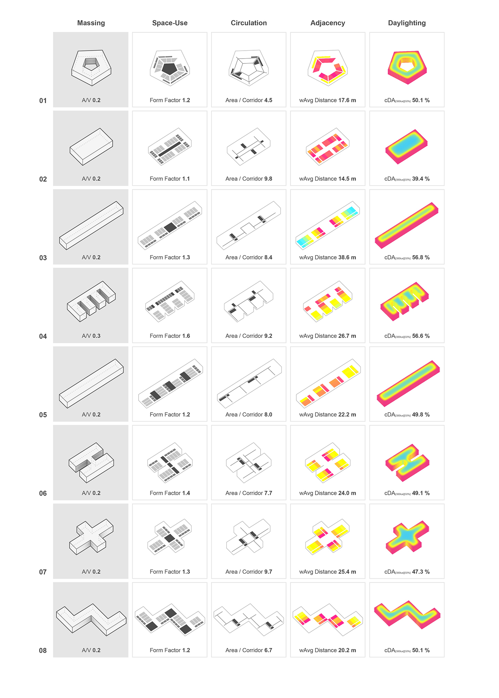{: .figure}
*Figure 1: Typological matrix and the results of phase 1*{: .caption}

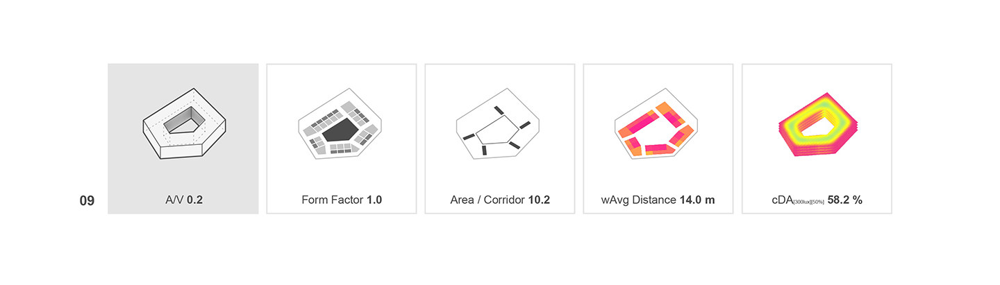{: .figure}
*Figure 2: Final massing design*{: .caption}

Figure 1 shows a matrix of the study’s results for each typology. Rather than looking for an optimal typology the authors sought to extract a series of design principles that could inform the later stages of the design decision-making process. The compactness ranged from 1.1 to 1.6. Typologies 1, 2, 8 score the highest rating. In the 3rd column of Figure 1, the efficiency of the circulation system is represented by a wire-frame drawing of corridors and vertical circulation points. Typology 2 with its closed-loop inner corridor seems to have a significant advantage over typologies with non-continuous circulation systems, such as 5 and 6: an equal-length corridor segment serves a higher portion of the typology’s area. In the 4th column, adjacency is plotted by color-coding each room from magenta to cyan, with magenta representing a high score. The typologies organized around a central shared space (1, 2) appear to perform better than the distributed shared space ones (5, 8). Up to this point, typologies 1 and 2 seem to strike the best balance of the aforementioned metrics. However, looking at the daylighting scores in the 5th column reveals that a typology with an appropriately proportioned atrium (1) has the potential to combine well-located shared spaces and higher daylight availability.

### Discussion

Phase 1 reveals that a compact arrangement of spaces around one central shared space (1, 2) would be more suitable to provide a collaborative research environment. This central shared space, if designed as an atrium, could also have a big impact on the environmental performance of the massing: providing good daylight even for relatively deep floor-plates. An atrium could theoretically be combined with a wide variety of massing shapes, such as a circle or a square. Feasibility limitations, the requirement for a rectangular grid and functional distribution guidelines indicated that a 5-sided polygon could be the most suitable massing shape.


## Phase 2: Floor plan design

### Inputs

* Envelope shape, rotation and orientation
* Area requirements
* Internal organization scheme

### Goals

* Arranging the program of the building
* Designing the internal subdivision system
* Deciding on a material and construction standard

### Questions

* How do we negotiate the relationship between labs and offices?
* How do we reduce airflow rates in the labs?
* How do we minimie heating/cooling loads in labs and offices?
* What is the optimal U-value for the façade?

### Methodology

In Phase 2, the authors aimed to develop a functioning floor plan. They therefore filtered the principles derived from Phase 1 and designed a pentagon-based massing with fine-tuned proportions.

This new design had to be re-evaluated against the metrics of Phase 1 in order to validate that the combined principles can reach better scores [Fig.2]. 
In order to iterate over a wide range of possible designs that all incorporate the aforementioned principles while maintaining adaptability to changes in the design brief, a parametric model was built in Rhinoceros 3D / Grasshopper. The parametric model is based on five points controlled by a closed system of five segment length parameters and two angle parameters [Fig. 3-1].

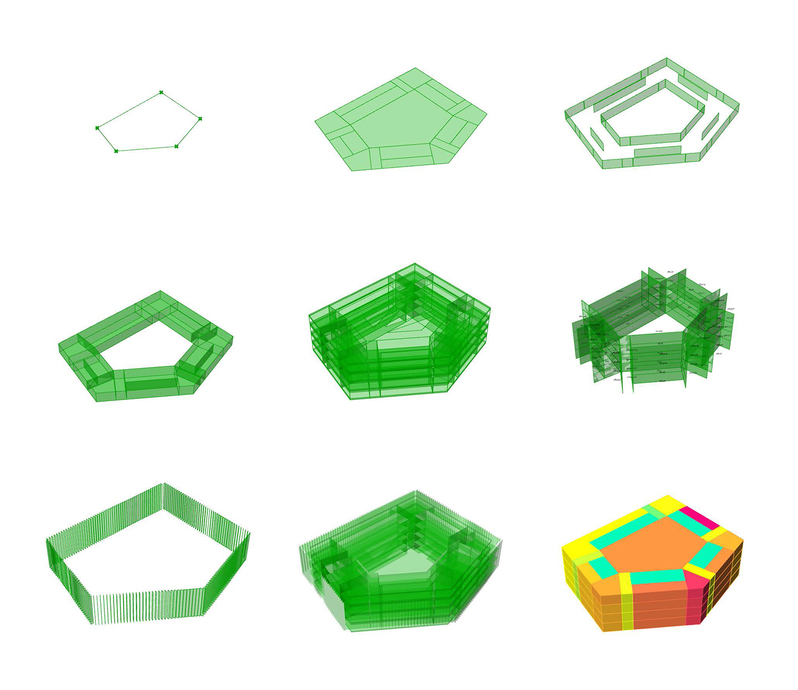{: .figure}
*Figure 3: Parametric model build-up*{: .caption}

A poly-line connecting the points, forms the main circulation corridor around the central atrium. Through offsetting this poly-line three perimeter bands were generated to accommodate functions and circulation. These bands were further subdivided into individual rooms [Fig. 3-2]. The outline of the floor plan was shattered into smaller segments that were scaled and extruded to generate the external window geometry. A similar geometric procedure was followed to generate the internal windows [Fig. 3-3]. All the geometries were then extruded and stacked four times to generate the whole-building model [Fig. 3-4 and 3-5]. The authors focused on two evaluation areas:

* Perimeter bands: floor plan layout
* Atrium: natural ventilation potential

For the first evaluation area, the design challenge was the economical and functional placement of the circulation, lab and office spaces. Two layout variants were tested [Fig. 4]. 

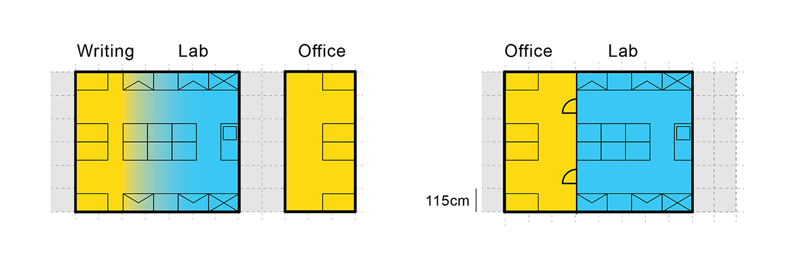{: .figure}
*Figure 4: Spatial configuration of laboratory and office work areas*{: .caption}

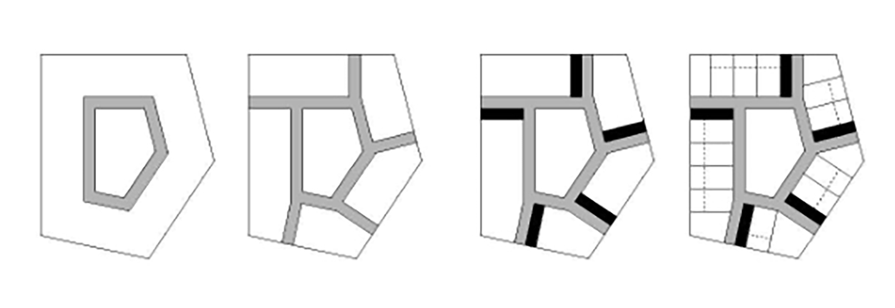{: .figure}
*Figure 5: Conceptual build-up of the typical floor-plan; circulation in gray and core locations in black*{: .caption}

The first layout variant included a traditional laboratory setup with laboratory spaces and writing desks [[Cordes and Holzkamm, 2007]](#references). According to the local building code, these desks don’t qualify as permanent office spaces. Hence, separate office spaces had to be provided. The second layout variant aimed to enhance the efficiency of the traditional setup by slightly increasing the writing desk area within the labs, and then separating them by a lightweight transparent interior partition. This way a twofold result was achieved: the writing desks counted towards workspace area leading to a more space-efficient scheme, while the actual volume of the lab was reduced. A reduction in lab volume was expected to yield significantly lower overall ventilation rates and energy demand. In the next step, the authors implemented high-efficiency conditioning systems with heat recovery and free cooling functionality. A photovoltaic system on the roof was also implemented to offset electrical equipment loads. 
The second focus area was the atrium. The design challenge was to make the atrium naturally ventilated. The thermal model of the atrium was built based on the assumption that the air within the zone was well-mixed. In the winter case, this assumption is justifiable due to the implementation of an inverted chimney for air recirculation that would operate against the air’s natural stratification. In the summer case, this assumption might be an oversimplification. It was, however, regarded as sufficient for design feedback. The authors modelled natural ventilation based on the stack effect as described in Formula 1. 

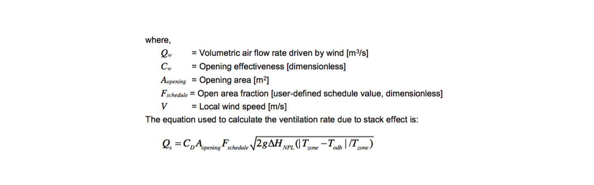{: .figure}
*Formula 1: Stack ventilation equation*{: .caption}

In order to achieve a naturally ventilated atrium the authors tested different atrium roof opening ratios, ventilation area values, shading device types, glazing types, and atrium roof insulation levels. 


### Results

Figure 6 shows the perimeter energy loads and their step by step reduction. The base case variant yields loads around 1100 kWh/m2/a. The first improvement shows a 4% reduction due to increased insulation, improved glazing types and the implementation of a dimming system. Next the shift from layout variant one to layout variant two is shown: the impact of the floor plan layout on energy demand is illustrated by a 28% reduction over the base case. Cooling and heating loads are mostly dominated by high ventilation rates and suggest the implementation of heat recovery and free cooling. In combination with the previous steps this leads to an overall reduction in energy demand of 79%. With an efficient heating and cooling energy supply system and a photovoltaic array, the original energy loads can be further reduced to 91%.


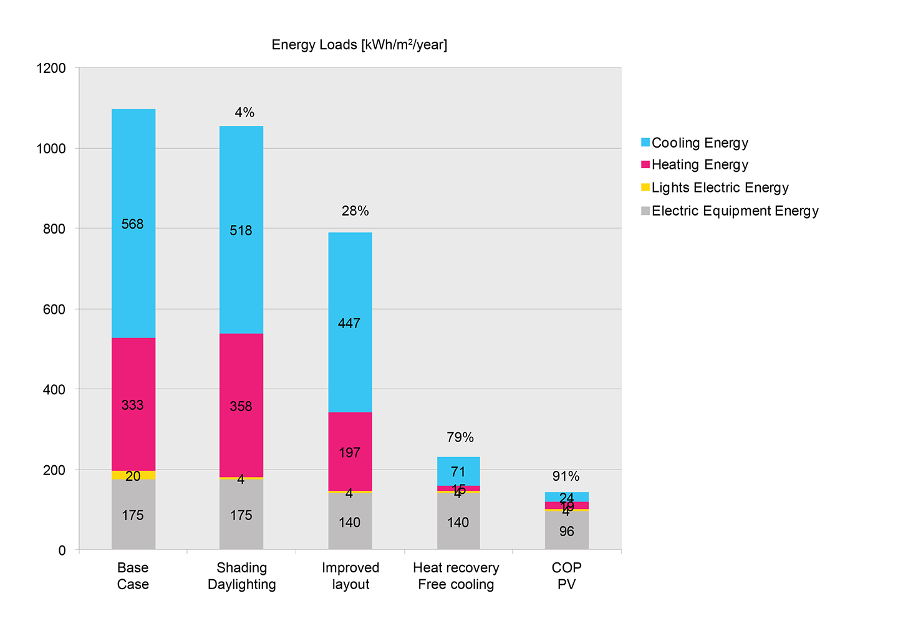{: .figure}
*Figure 6: Perimeter energy use intensity reduction*{: .caption}

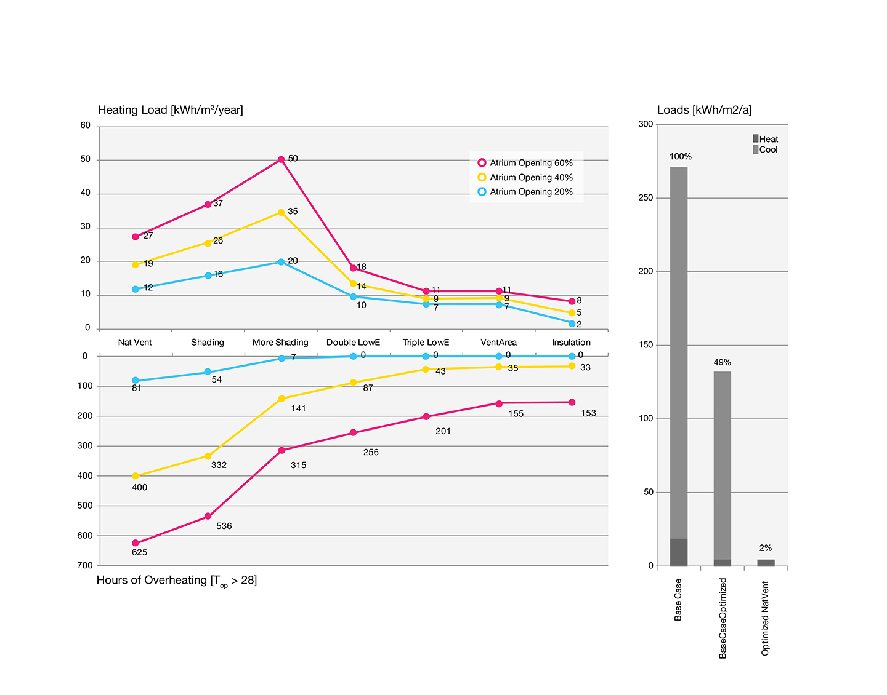{: .figure}
*Figure 7: Atrium design iterations*{: .caption}

In Figure 7 (right), a cumulative image of both heating and cooling loads for the atrium is presented. The implementation of natural ventilation leads to a 98% reduction on these loads. Figure 7(left) presents the atrium design iterations. The combined figure shows heating loads at the top graph and hours of overheating (Top > 28&deg;C) at the bottom graph. The three colored lines represent different atrium roof opening ratios (20%, 40%, 60%). With the reduction of overheating hours due to the implementation of fixed shading on the atrium roof, an increase in heating loads can be observed. This is mostly due to clipped-out direct solar radiation on the atrium roof glass that leads to a reduction of solar heat gains in the summer, but also in the winter. This increased heating demand is lowered with the implementation of double glazing with Low-E coating. Triple glazing with Low-E coating as well as an increasing in ventilation area have a smaller effect.


### Discussion

Phase 2 shows that both the atrium and the glass partitions are essential components in the environmental concept of the building. The clear separation of office and lab spaces helps to significantly reduce the required air-changes thus saving energy. Simultaneously, the atrium allows a double-sided daylight penetration into the space. 
Naturally ventilating the atrium presents a significant savings potential over a fully conditioned space. The comparison between the three atrium roof opening ratios however, reveals that a 60% opening ratio can’t easily be naturally ventilated and that a 20% or 40% opening ratio would be more suitable. The consequent increase of heating loads and decrease in overheating hours could be seen as an argument towards a dynamic shading system. This would allow benefiting from solar heat gains in the winter, while providing sufficient protection from solar radiation in the summer. This option however, was omitted due to practical reasons by the client. Hence, a good trade-off between good daylight supply from the atrium to the adjacent spaces and an acceptable range of overheating hours had to be found. Consequently, a more nuanced study of both the atrium roof and the perimeter façade is presented in Phase 3. 


## Phase 3: Optimization

### Inputs

* Perimeter shape and depth
* Schematic floor plan
* Atrium approximate roof opening ratio

### Goals

* Minimizing overheating hours and thermal loads in the atrium while maintaining an acceptable daylight contribution
* Minimizing daylight overexposure in the perimeter

### Questions

* What is an appropriate opening gradient for the atrium roof?
* How should the atrium roof shading system be designed?
* What is an appropriate spacing for the façade fins?

### Methodology

In phase 3 the authors focused on two main areas:

* Atrium roof and roof shading 
* The perimeter façade

The challenge for the first focus area was to find a good balance between a reduction of solar gains to make natural-ventilation feasible while not harming the daylight supply of the atrium facing spaces at the same time. The authors tested the impact of a static shading system with different cut-off angles while analyzing the daylight contribution of the atrium (the perimeter facades were closed off). The two competing metrics of choice were hours of overheating (Top > 28) versus the Continuous Daylight autonomy cDA[300lux][50%] at desk height for the 1st floor. Figure 8 shows the geometry of the atrium roof in more detail. The view shows the roof from below. 

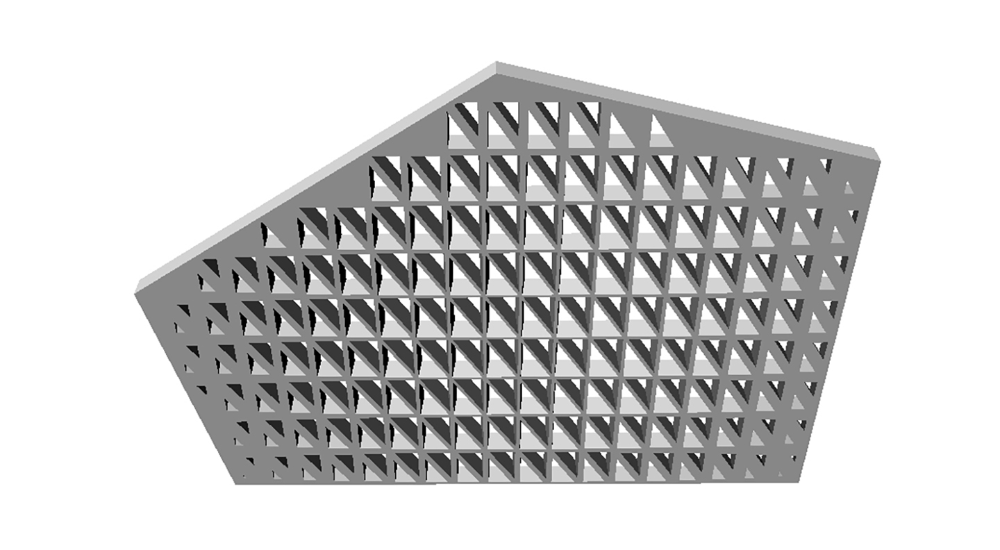{: .figure}
*Figure 8: Atrium roof and shading system close-up*{: .caption}

The second focus area addresses the question of useful daylight supply in the perimeter. The study investigates a typical floor plan’s useful daylight illuminance (UDI) [[Nabil & Mardaljevic, 2006]](#references). More specifically, the UDI>2000lux was used to measure the oversupply of daylight. To mitigate excessive day lighting vertical fins were introduced in addition to the 1.5m overhang created by the egress balconies. Several fin layouts with different spacing were tested.


### Results

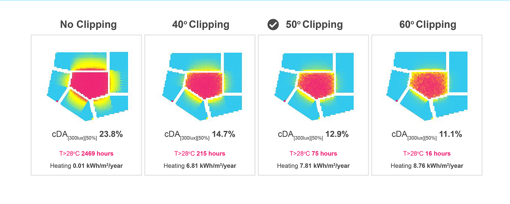{: .figure}
*Figure 9: Impact of fixed shading on the atriums daylight contribution on the floor plates*{: .caption}

Figure 9 shows the daylighting impact of the atrium in four stages. Without a shading device a cDA[300lux][50%] of 23.8% for the first floor is reached. The atrium is however also 2469h above 28°C operative temperature. With a 40° angle the daylight contribution is reduced to a 14.7% cDA[300lux][50%] score and the hours of overheating are reduced roughly to 1/10 of the variant without any shading. 50° and 60° angles further reduce the cDA[300lux][50%] to 12.9% and 11.1% and the hours of overheating to 75 and 16. For the upcoming analysis the authors chose to move forward with a 50° shading angle.

In Figure 10 the results of the shading-fin study for floor 1 are shown. Without fins the oversupply index UDI>2000lux indicates a near 35% score and marks all regions near the façade as overlit. Introducing fins that are 1.6m spaced reduces the UDI to 23.5%. Denser spacing can reduce the UDI>2000lux index to 14%. For each of the previously mentions steps Figure 11 shows the cDA[300lux][50%] scores. The results range from 92% to 87%.

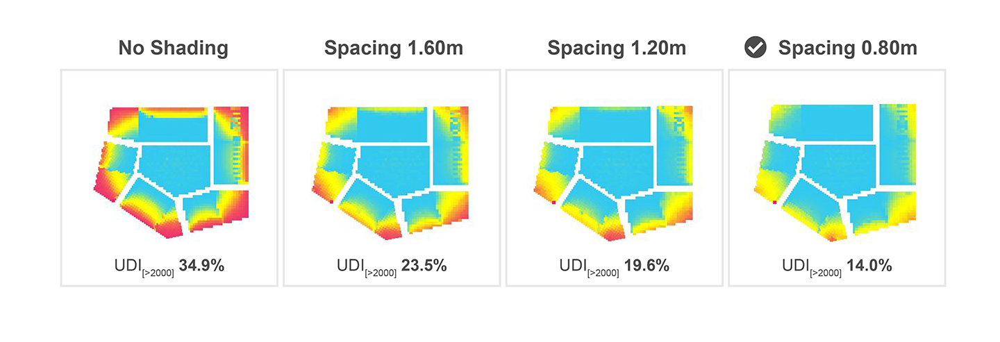{: .figure}
*Figure 10: Shading fin study to reduce daylight oversupply near the perimeter*{: .caption}

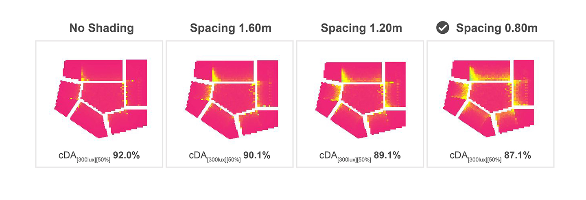{: .figure}
*Figure 11: Shading fin study to reduce daylight oversupply near the perimeter*{: .caption}

### Discussion

While the overall results of 75 hours of overheating and a cDA[300lux][50%] score 87.1% are acceptable the authors where surprised by the relatively small daylight contribution of the atrium shown in Figure 10. The significant reduction of daylight performance when shading is introduced is non-satisfying and reveals disadvantages of the fixed shading systems that where tested. For the actual design project the shading system could be revised to be more transparent to lower sun-angles and support higher solar gains and deeper daylight penetration in the darker and colder winter season. Furthermore, the parameterization of the fins was helpful to get an intuition of how “closed” the perimeter façade has to be laid out. Figure 10-3 that shows the 1.2 m spacing precedent indicates that a more differentiated and more flexible parameterization of the fin-design model could be more effective. For example, the fins in front of the corner spaces that are impacted from overexposure more severely should be treated differently. 


## Discussion

This study showed that the use of design evaluation in terms of environmental simulations can help guide design decisions. It has been shown that simulations can be used in the earliest phases – even before a design exists. Hence, no specific inputs are required.

The first challenge for the designer is the definition of a solution space. In Phase 1 this definition involved setting up a list of typologies and their inherent internal organization. The second challenge is the selection of “interesting” metrics. The authors’ goal in Phase 1 was to understand the qualities of a certain design principle. The morphological ratios were useful indicators but did not influence design decisions drastically. The adjacency graphs and the daylighting analysis, however, were valuable recourses that revealed intrinsic architectural qualities. The authors will certainly use both in future projects. A critical reader might argue that the presented results in Phase 1 are intuitive and do not need to be analyzed. Discussions with the client showed, however, that being able to quantify the impact of a design decision can be valuable.

Energy models were omitted for the first phase. Setting up a meaningful analysis that could provide qualitative feedback was also not possible due to time constraints. In later phases, however, the energy model yielded interesting insights. The interior partition was surprisingly effective and shifted the design/layout of the floor plan away from the more traditional laboratory layout shown in Figure 4-1. A 28% reduction of the energy loads is a significant contribution to the overall efficiency of the building that was solely achieved through an architectural consideration. For the authors this a clear indicator that architects should do early design energy modeling. The floor plan considerations mentioned before are clearly in the architect’s domain and being able to quantify the impact of such improvements is a key aspect of claiming the credit for it.

The overall effort to build the thermal models was feasible. All required inputs such as the geometry and space definitions were available either through the design brief, architectural decisions or best practice templates. Large remaining uncertainty was introduced by the internal loads for the laboratories that are highly dependent on what equipment will be used and what kind of research will be conducted. At the design stage this information was unavailable and such quantities are expected to change often over the lifetime of the building.

Being the project architect and the energy modeler for the early design phases of the project was both a challenge and an opportunity. In the earliest phases new ideas were generated with high frequency and needed to be weaved into the rationale of the design. In order to leave the creative momentum undisturbed, simulations were only executed if a fast turnover of results was expected. This level of integration between performance evaluation and design would have been difficult to achieve with an external consultant. 

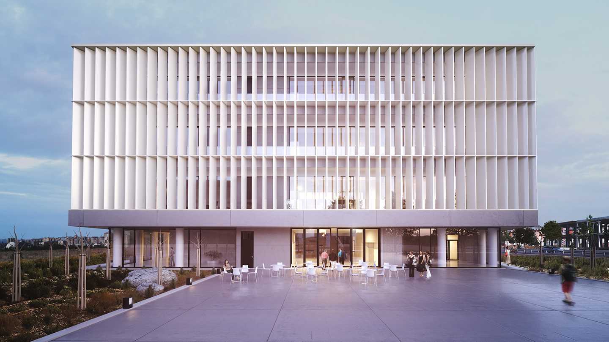{: .figure}
*Figure 12: Exterior rendering*{: .caption}

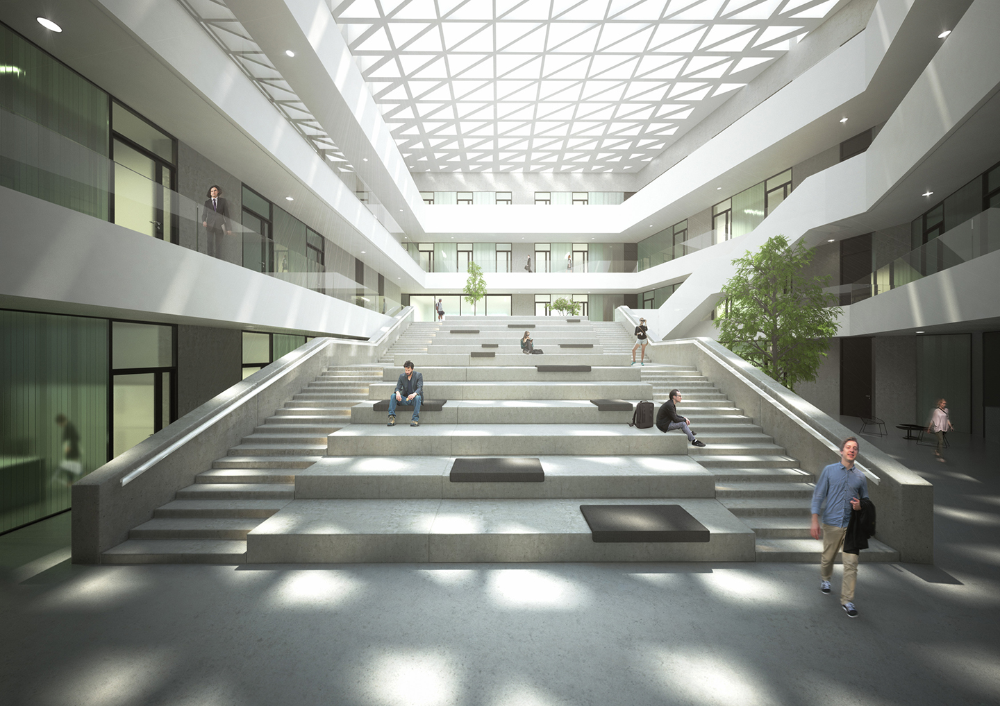{: .figure}
*Figure 13: Interior rendering*{: .caption}

## Conclusion

This case study illustrated the benefits of implementing performance-driven design approaches. The methods used informed the design process from the initial massing design phase to the detailed evaluation of focus areas such as the atrium roof and the perimeter facade. The implemented design measures had a significant impact on energy load reduction, daylight availability and visual comfort. This case study therefore showcased that environmental performance simulations can be useful and well-integrated to the design process.


## Acknowledgements

The authors would like to thank Transsolar Energietechnik GmbH Munich and the Alexander S. Onassis Public Benefit Foundation for productive discussions and partial funding of this research project.

## References

* AIA (2012). The AIA Energy Modeling Practice Guide. Retrieved March 2015. [https://www.aia.org/resources/8056-architects-guide-to-integrating-energy-modeli](https://www.aia.org/resources/8056-architects-guide-to-integrating-energy-modeli)

* Cordes, S., & Holzkamm, I. (2007). Forschungs-zentren und Laborgebäude: Organisation, bauliche Konzeption und Ressourcenplanung für Forschungsgebäude der Biowissenschaften, Chemie und Nanotechnologie. HIS.

* de Wilde, P., Augenbroe, G., & van der Voorden, M. (2002). Design Analysis Integration: Supporting the Selection of Energy Saving Building Components. Building and environment 37 (8–9): 807–816.

* DOE (2012). EnergyPlus Energy Simulation Software, V.7, [https://energyplus.net](https://energyplus.net)

* Dogan, T., Reinhart, C.F., & Michalatos, P. (2012). Urban daylight simulation calculating the daylit area of urban designs. Proceedings of SimBuild.

* Dogan, T. (2013). Archsim Energy Modeling Software. Retrieved November 2013. [http://www.archsim.com](http://www.archsim.com)

* Dogan, T., Reinhart, C.F., & Michalatos, P. (2015). Autozoner: an algorithm for automatic thermal zoning of buildings with unknown interior space definitions. Journal of Building Performance Simulation, (ahead-of-print): 1-14.

* Jakubiec, J. A., & Reinhart, C.F. (2011). DIVA 2.0: Integrating daylight and thermal simulations using Rhinoceros 3D, Daysim and EnergyPlus. Proceedings of Building Simulation 2012: 12th Conference of the International Building Performance Association.

* Lagios, K., Niemasz, J., & Reinhart, C.F. (2010). Animated building performance simulation (abps)-linking rhinoceros/grasshopper with radiance/daysim. Proceedings of SimBuild.

* McNeel, R. (2012). Grasshopper - Generative Modeling with Rhino, McNeel North America, Seattle, WA, USA. [http://www.grasshopper3d.com](http://www.grasshopper3d.com)

* McNeel, R. (2012). Rhinoceros - NURBS Modeling for Windows (version 5.0), McNeel North America, Seattle, WA, USA. [http://www.rhino3d.com](http://www.rhino3d.com)

* Morbitzer, C., Strachan, P.A., Webster, J., Spires, B., & Cafferty, D. (2001). Integration of building simulation into the design process of an architectural practice. Proceedings of Building Simulation 207: 7th Conference of the International Building Performance Association.

* Nabil, A., & Mardaljevic, J. (2006). Useful daylight illuminances: A replacement for daylight factors. Energy and buildings, 38(7), 905-913.

* Neufert, E., Neufert, P., & Kister, J. (2012). Architects' data. John Wiley & Sons.

* Reinhart, C.F., Mardaljevic, J., & Rogers, Z. (2006). Dynamic daylight performance metrics for sustainable building design. Leukos, 3(1), 7-31.

* Roudsari, M.S., Pak, M., & Smith, A. (2013). Ladybug: A Parametric Environmental Plugin for Grasshopper to Help Designers Create an Environmentally-Conscious Design. Proceedings of Building Simulation 2013: 13th Conference of the International Building Performance Association.

* Jocher, T., Loch, S., Lederer, A., Pampe, B., Gasser, M., zur Brügge, C., Tvrtkovic, M., Stamm-Teske, W., Fischer, K., & Haag, T. (2010). Raumpilot. Wüstenrot Stiftung

* US Green Building Council (2014). LEED rating systems. Retrieved November 2014. [http://www.usgbc.org/leed#rating](http://www.usgbc.org/leed#rating)
